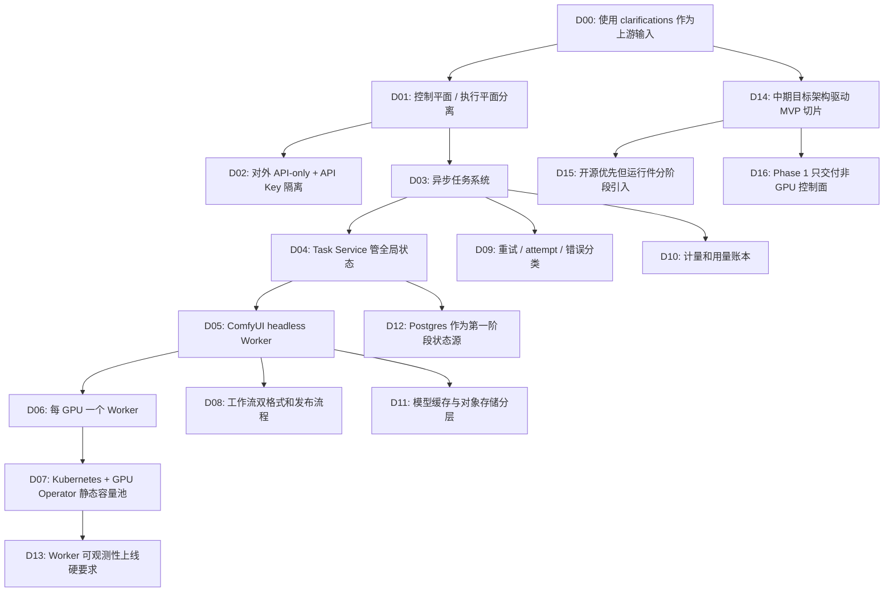

# ComfyUI + LTX 2.3 视频生成服务架构决策日志

> 决策链来源: `clarifications/architecture/round-1.md` 到 `round-6.md`。当前缺少正式 proposal/feature-specs，因此所有决策均引用已确认 CLR 条目。

## 决策链概览

## D00: 上游输入来源

- **时间**: 2026-07-13
- **级别**: L1
- **上下文**: 仓库缺少 `proposal.md`、`feature-specs/` 和 `prd_review.md`，但已有 6 轮 pb-v1-talk 澄清记录。
- **方案 A**: 停止 designing，回退到 discovery/drafting。
- **方案 B**: 基于 clarifications 产出初版架构，并明确门禁缺失风险。
- **推荐**: 方案 B。
- **理由**: 用户已明确要求继续推进，且澄清记录已覆盖关键架构约束；停止会降低当前讨论成果的利用率。
- **决策结果**: 采用方案 B，但在 architecture.md 头部标注前置门禁缺失。
- **影响**: Fidelity Gate 使用派生 P0 能力清单，不声称已存在正式 feature specs。

## D01: 控制平面 / 执行平面分离

- **时间**: 2026-07-13
- **级别**: L1
- **上下文**: 需要 API、任务、重试、计数、工作流管理和 GPU 执行。
- **方案 A**: 业务系统直接调用 ComfyUI，把 ComfyUI 作为核心调度中心。
- **方案 B**: 控制平面负责业务状态，ComfyUI 只作为执行平面 Worker。
- **推荐**: 方案 B。
- **理由**: ComfyUI 队列适合单实例执行，不适合作 SaaS 全局任务、重试、配额和审计。
- **决策结果**: 控制平面 / 执行平面分离。
- **前置引用**: CLR-ARCH-009, CLR-ARCH-014。
- **影响**: 后续必须引入 Task Service、Worker Registry 和 Worker Adapter。

## D02: 对外 API-only + API Key 隔离

- **时间**: 2026-07-13
- **级别**: L1
- **上下文**: Q21 用户确认“对外只提供 API，通过 key 做资源隔离”。
- **方案 A**: 外部 Web UI + 账号体系。
- **方案 B**: 外部 API-only + API Key。
- **推荐**: 方案 B。
- **理由**: 这是用户最新确认；组织/团队关系后置，避免第一阶段权限模型过重。
- **决策结果**: 第一阶段 API-only，通过 API Key 隔离资源。
- **前置引用**: CLR-ARCH-024。
- **影响**: 外部用户界面不进入第一阶段架构；内部后台保留。

## D03: 异步任务系统

- **时间**: 2026-07-13
- **级别**: L1
- **上下文**: LTX 视频生成是长任务。
- **方案 A**: 同步 HTTP 等待结果。
- **方案 B**: 异步提交、状态查询、结果获取。
- **推荐**: 方案 B。
- **理由**: 视频生成耗时长且易失败，异步模型才能支持排队、重试和计数。
- **决策结果**: 外部提交任务后返回 task_id。
- **前置引用**: CLR-ARCH-005。
- **影响**: 必须设计任务状态机和 attempt 模型。

## D04: Task Service 管理全局任务状态

- **时间**: 2026-07-13
- **级别**: L2
- **上下文**: D03 选择异步任务，D01 选择 ComfyUI 只做执行。
- **方案 A**: 使用 ComfyUI 内部队列作为全局任务队列。
- **方案 B**: Task Service 作为全局任务状态源，ComfyUI 内部队列只做 Worker 本地队列。
- **推荐**: 方案 B。
- **理由**: 用户级排队、取消、重试、配额和统计都不能可靠依赖单个 ComfyUI 实例。
- **决策结果**: Task Service 管全局任务，ComfyUI prompt_id 归属于 attempt。
- **前置引用**: D01, D03, CLR-ARCH-014, CLR-ARCH-015。
- **影响**: 数据模型需要 `video_tasks` 和 `task_attempts`。

## D05: ComfyUI headless Worker

- **时间**: 2026-07-13
- **级别**: L1
- **上下文**: 用户要求遵循 ComfyUI 推荐实践。
- **方案 A**: 暴露 ComfyUI UI 或让用户编辑节点图。
- **方案 B**: ComfyUI headless，生产只通过 Server API、Workflow API Format、WebSocket + History。
- **推荐**: 方案 B。
- **理由**: 用户确认不开放自由节点图；ComfyUI Server API 是生产集成边界。
- **决策结果**: ComfyUI 作为 headless Worker，由 Adapter 调用。
- **前置引用**: CLR-ARCH-008, CLR-ARCH-009, CLR-ARCH-010, CLR-ARCH-011。
- **影响**: 需要 Workflow Service 管理 API Format。

## D06: 每张 GPU 一个 Worker

- **时间**: 2026-07-13
- **级别**: L1
- **上下文**: 用户确认第一阶段单任务单卡。
- **方案 A**: 一个 Worker 管整机 8 卡。
- **方案 B**: 每张 GPU 一个 Worker Pod。
- **推荐**: 方案 B。
- **理由**: 调度、失败隔离、容量计数和显存管理更清晰。
- **决策结果**: 一台 8 卡服务器部署 8 个 Worker。
- **前置引用**: CLR-ARCH-007, CLR-ARCH-017。
- **影响**: Worker Registry 的容量单位是 GPU Worker。

## D07: Kubernetes + NVIDIA GPU Operator 静态容量池

- **时间**: 2026-07-13
- **级别**: L1
- **上下文**: 用户已有多台 GPU 服务器，第一阶段不做自动扩容。
- **方案 A**: 每台机器手工部署 ComfyUI。
- **方案 B**: Kubernetes + NVIDIA GPU Operator。
- **推荐**: 方案 B。
- **理由**: 需要 GPU 资源声明、Pod 生命周期、服务发现和监控；手工部署难以运维。
- **决策结果**: 采用 Kubernetes + NVIDIA GPU Operator，静态容量池。
- **前置引用**: CLR-ARCH-016, CLR-ARCH-027。
- **影响**: 部署复杂度转移到集群和 Worker 镜像标准化。

## D08: 工作流双格式和发布流程

- **时间**: 2026-07-13
- **级别**: L2
- **上下文**: ComfyUI 编辑格式和 API Format 不同，工作流变更会影响线上任务。
- **方案 A**: 只保存 API Format。
- **方案 B**: 源 workflow + API Format 双格式，并提供 draft/testing/published/rollback。
- **推荐**: 方案 B。
- **理由**: 编辑、审计、发布和回滚都需要源格式；执行需要 API Format。
- **决策结果**: Workflow Service 保存双格式和发布状态。
- **前置引用**: CLR-ARCH-010, CLR-ARCH-028。
- **影响**: 数据模型需要 `workflow_templates`、`workflow_versions`、`workflow_profiles`。

## D09: 重试 / attempt / 错误分类

- **时间**: 2026-07-13
- **级别**: L2
- **上下文**: GPU 成本高，失败不能盲目重试。
- **方案 A**: 所有失败都自动重试。
- **方案 B**: 只重试可恢复错误，最多 3 次 attempt。
- **推荐**: 方案 B。
- **理由**: 参数错误和策略拒绝重试没有价值；Worker crash/transient 才值得重试。
- **决策结果**: 错误分类至少包含 transient、worker_crash、oom、invalid_input、policy_rejected。
- **前置引用**: CLR-ARCH-019, CLR-ARCH-020。
- **影响**: Task Service 必须记录 error_class 和 attempt_count。

## D10: 计量和用量账本

- **时间**: 2026-07-13
- **级别**: L2
- **上下文**: 用户需要任务计数和价格基础，但不做复杂价格系统。
- **方案 A**: 只记录成功任务数。
- **方案 B**: 记录任务数、成功产出、预估/实际 GPU 秒和 attempt。
- **推荐**: 方案 B。
- **理由**: 成本来自 GPU 消耗和失败尝试，只看成功任务会失真。
- **决策结果**: 建立 usage ledger，不在第一阶段做复杂价格表。
- **前置引用**: CLR-ARCH-021, CLR-ARCH-025。
- **影响**: 计费系统后续可以基于 ledger 演进。

## D11: 模型缓存与对象存储分层

- **时间**: 2026-07-13
- **级别**: L2
- **上下文**: LTX 模型大，用户输入输出需要集中访问。
- **方案 A**: 全部走对象存储。
- **方案 B**: 模型走节点本地 NVMe/PVC 缓存，输入输出走对象存储抽象。
- **推荐**: 方案 B。
- **理由**: 模型频繁远程拉取会拖慢启动；输入输出需要集中管理和下载。
- **决策结果**: 对象存储不限定 S3/MinIO，使用适配器抽象。
- **前置引用**: CLR-ARCH-018。
- **影响**: Worker 镜像和部署需要模型缓存挂载。

## D12: Postgres 作为第一阶段任务状态源

- **时间**: 2026-07-13
- **级别**: L2
- **上下文**: Phase 1 不接 GPU，但仍需要异步任务状态机；Phase 2 接入静态 GPU 容量池后，吞吐核心瓶颈会转为 GPU 而不是队列。
- **方案 A**: 第一阶段直接引入 Temporal。
- **方案 B**: PostgreSQL 管任务状态和领取，后续通过 Queue Adapter 替换。
- **推荐**: 方案 B。
- **理由**: 更简单、依赖更少，足够支撑 Phase 1 控制面和 Phase 2 初始静态 GPU 池；避免在尚未压测前引入工作流引擎复杂度。
- **决策结果**: Phase 1 Postgres 为任务状态源；Dispatcher 可使用行锁/状态转换领取任务。
- **前置引用**: D03, D04, CLR-ARCH-027。
- **影响**: 后续若需要复杂编排，可把 Dispatcher 替换为 Temporal Adapter。

## D13: Worker 可观测性上线硬要求

- **时间**: 2026-07-13
- **级别**: L2
- **上下文**: GPU 任务失败和性能问题需要定位。
- **方案 A**: 先上线，问题发生后看日志。
- **方案 B**: Worker 指标作为上线硬要求。
- **推荐**: 方案 B。
- **理由**: 视频生成问题通常来自 GPU、显存、工作流版本和输入组合；缺指标会导致不可诊断。
- **决策结果**: 必须采集 GPU 利用率、显存、队列长度、成功率、失败原因、平均耗时。
- **前置引用**: CLR-ARCH-026。
- **影响**: Worker Adapter 和部署需要暴露 metrics endpoint。

## D14: 中期目标架构驱动 MVP 切片

- **时间**: 2026-07-13
- **级别**: L1
- **上下文**: 用户明确要求不要做 MVP 临时版本，而是先有中期规划，再基于中期规划实现 MVP 功能。
- **方案 A**: 为 MVP 快速拼一套只在测试环境可用的临时实现。
- **方案 B**: 定义中期目标架构，MVP 只实现其中最小可运行切片，但保持接口和模块边界稳定。
- **推荐**: 方案 B。
- **理由**: 视频生成系统的高风险点在任务状态、Worker 边界、工作流版本和资产存储。如果 MVP 在这些点临时实现，后续接入多 GPU 节点、Redis/KEDA/Kong 时会重写核心链路。
- **决策结果**: MVP 必须实现中期架构的第一切片，而不是临时脚本。运行件可以简化，边界不能简化。
- **前置引用**: D01-D13。
- **影响**: `architecture.md` 增加中期规划定位；`tasks.md` 必须把适配器边界列为验收标准。

## D15: 开源优先但运行件分阶段引入

- **时间**: 2026-07-13
- **级别**: L2
- **上下文**: 用户补充希望组件基于开源实现，并给出 Kong/FastAPI、KEDA、GPU Operator、ComfyUI、ComfyUI-LTXVideo、MinIO、PostgreSQL、Redis、Prometheus/Grafana、DCGM Exporter 等候选组合。
- **方案 A**: MVP 一次性引入全部开源组件。
- **方案 B**: 中期架构采用开源优先，但 MVP 只引入必要运行件；Kong、Redis、KEDA 等在边界稳定后进入 Beta/Scale 阶段。
- **推荐**: 方案 B。
- **理由**: Phase 1 的目标是跑通 1 个 web/control 节点的非 GPU 控制面。一次性引入 Kong、Redis、KEDA 或 GPU 运行件会增加故障面，不会提高第一阶段成功率。通过 Edge Gateway、QueueAdapter、ObjectStorageAdapter、ExecutorAdapter 保持演进路径即可。
- **决策结果**: Phase 1 默认采用 FastAPI、PostgreSQL、MinIO 和控制面基础指标；Kubernetes/k3s、NVIDIA GPU Operator、ComfyUI、ComfyUI-LTXVideo、DCGM Exporter 进入 Phase 2；Kong、Redis/Temporal、KEDA 进入 Beta/Scale 阶段。
- **前置引用**: D02, D07, D11, D12, D13, D14。
- **影响**: MVP 任务需要明确哪些组件是当前运行依赖，哪些是中期兼容目标。

## D16: Phase 1 只交付非 GPU 控制面

- **时间**: 2026-07-13
- **级别**: L1
- **上下文**: 用户明确要求分阶段完成：第一阶段完成非 GPU 服务调度部分，不处理 GPU 服务器及相关逻辑；GPU 相关放在第二阶段。
- **方案 A**: Phase 1 继续实现完整 GPU E2E。
- **方案 B**: Phase 1 只实现 web/control 面和任务控制面，用 `ExecutorAdapter` 的 mock/local implementation 验证任务状态机；Phase 2 再接入 GPU Worker、ComfyUI/LTX、K8s/GPU Operator 和 GPU 指标。
- **推荐**: 方案 B。
- **理由**: 这符合用户最新阶段目标，同时不牺牲中期架构。通过 `ExecutorAdapter` 保持执行后端可替换，Phase 2 接 GPU 时不需要改外部 API、任务状态机、attempt、workflow、asset、usage ledger。
- **决策结果**: Phase 1 范围为 API Key、Asset、Workflow、Task、QueueAdapter、ExecutorAdapter mock/local、Usage、Admin、控制面健康检查；Phase 2 范围为 GPU 节点、Worker Registry、GPU Worker Adapter、ComfyUI/LTX、Kubernetes/GPU Operator、DCGM 和真实 GPU E2E。
- **前置引用**: D01-D15。
- **影响**: `tasks.md` 需要重排为 Phase 1/Phase 2；所有 GPU 相关任务从 Phase 1 P0 移到 Phase 2。
