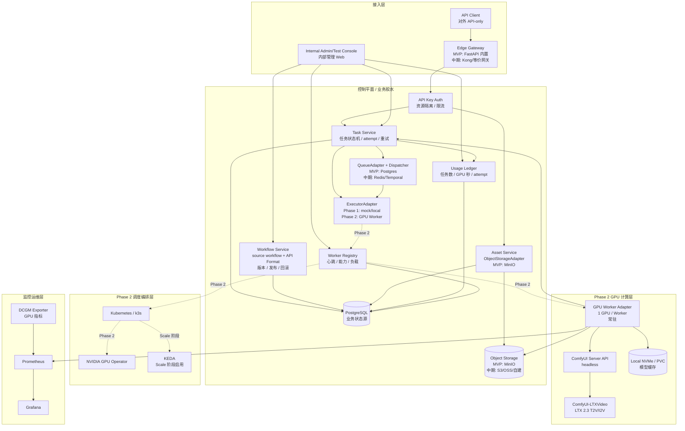
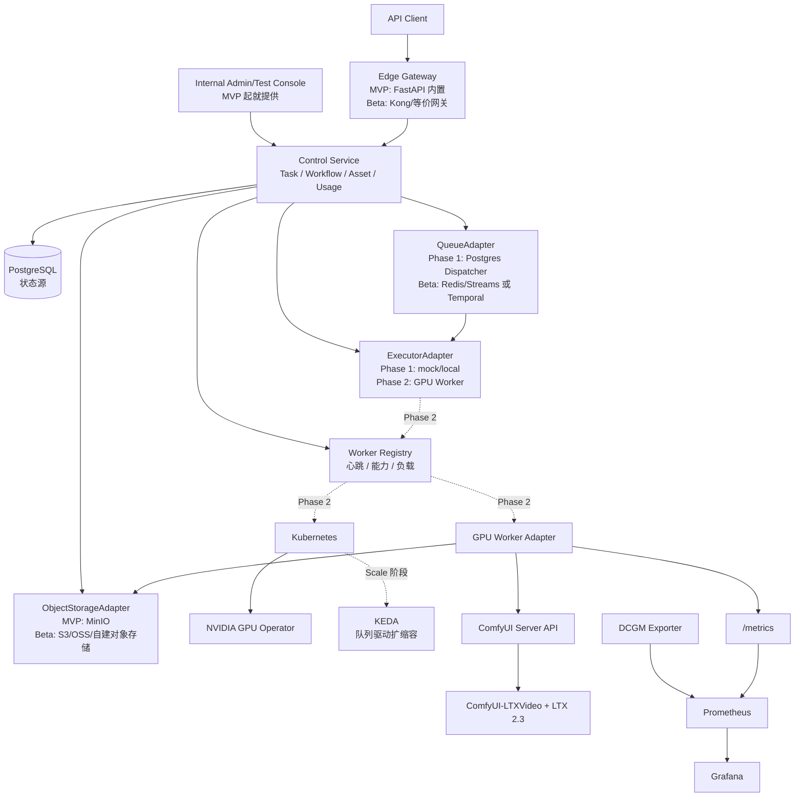
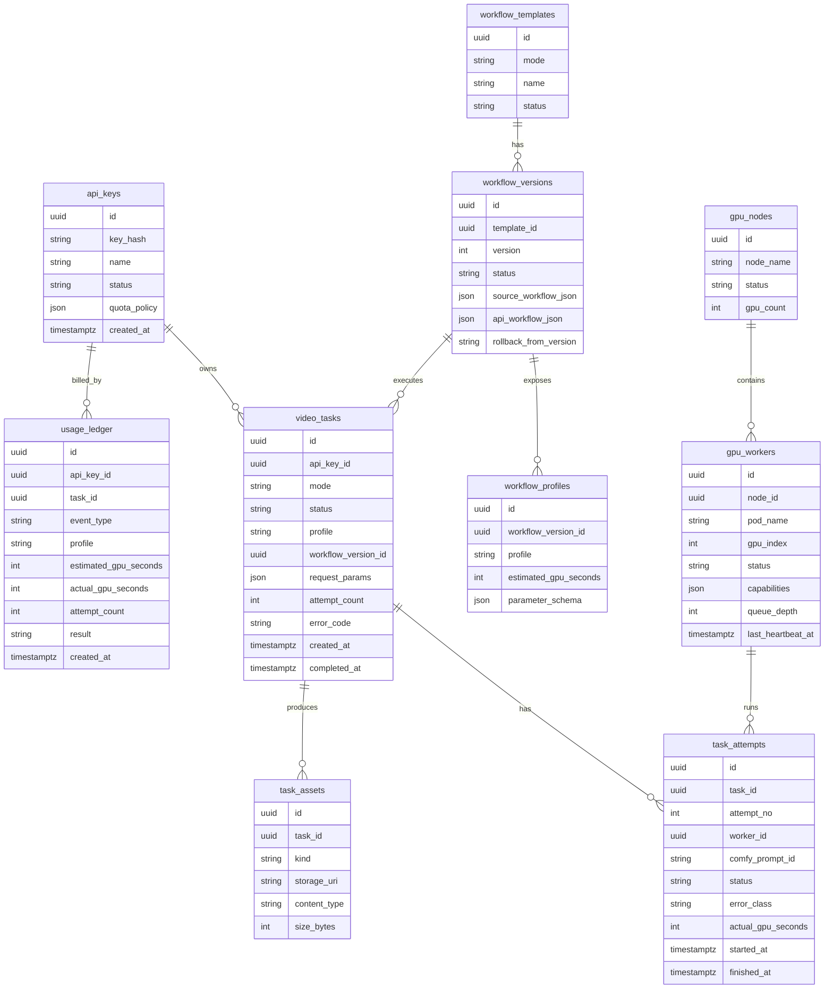
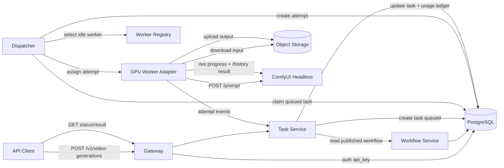
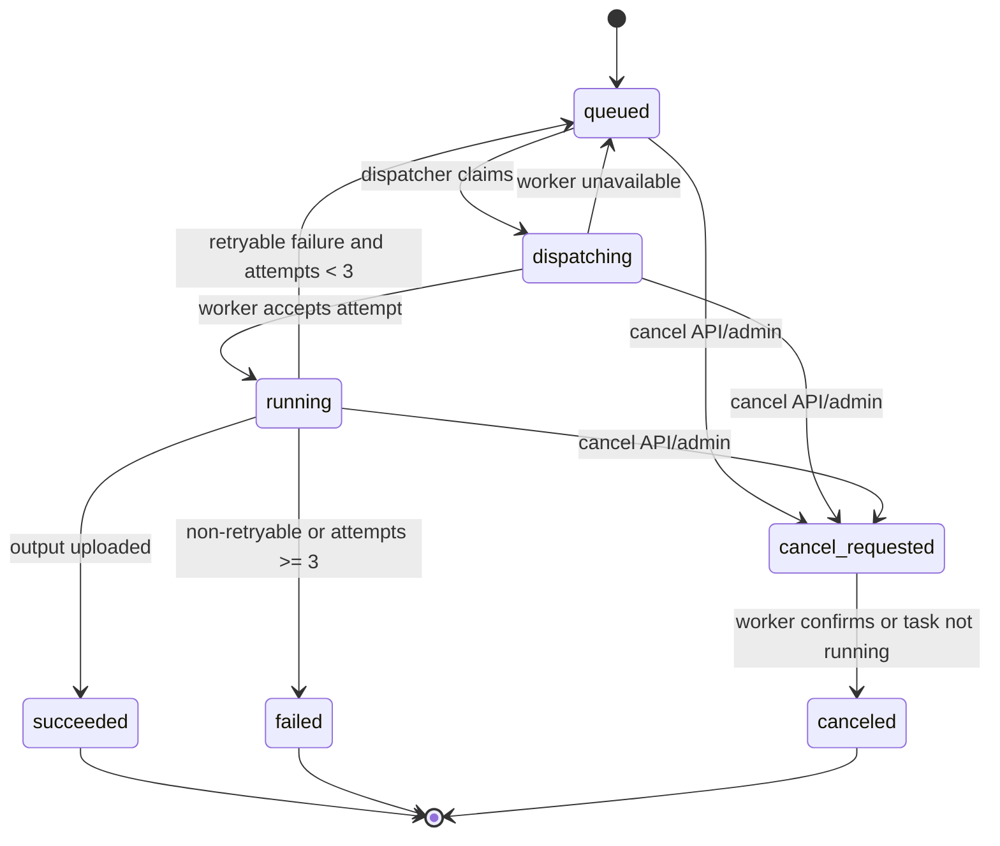
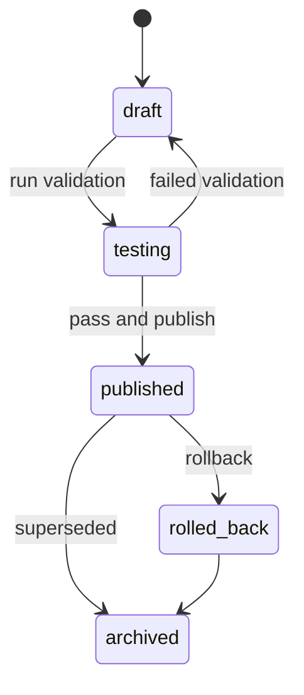
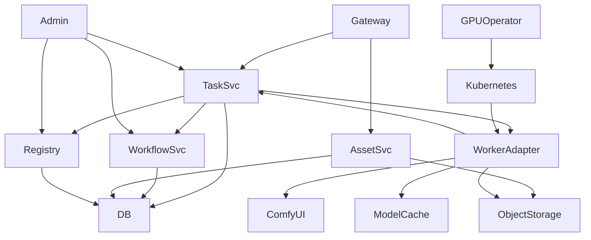

# ComfyUI + LTX 2.3 视频生成服务架构设计

> 前置门禁说明: 当前仓库缺少 `proposal.md`、`feature-spec-index.md`、`feature-specs/` 和 `prd_review.md`。本架构以 `clarifications/architecture/round-1.md` 到 `round-6.md` 的已确认结论为上游约束。未伪造 feature-specs；Fidelity Gate 使用下文“派生 P0 能力清单”校验。

## 1. 需求概述

### 1.1 目标

基于 ComfyUI 和 LTX 2.3 搭建一套视频生成系统服务：

- 对外只提供 API，通过 API Key 做资源隔离。
- 支持文生视频和图生视频。
- 采用异步任务模式，支持任务状态查询、失败重试和任务计数。
- 内部管理工作流版本、任务、失败重跑、GPU Worker 状态和用户额度/用量。
- 在已有 8 卡 GPU 服务器资源池上部署 LTX 2.3，第一阶段采用静态容量池。

### 1.2 派生 P0 能力清单

| Feature ID | P0 能力 | 来源 |
|---|---|---|
| F-001 | API Key 认证与资源隔离 | CLR-ARCH-024 |
| F-002 | 文生视频 API | CLR-ARCH-001, CLR-ARCH-012 |
| F-003 | 图生视频 API | CLR-ARCH-001, CLR-ARCH-012 |
| F-004 | 异步任务提交、查询、结果获取 | CLR-ARCH-005, CLR-ARCH-014 |
| F-005 | ComfyUI headless Worker 执行 | CLR-ARCH-006, CLR-ARCH-009, CLR-ARCH-011 |
| F-006 | 工作流双格式、版本、发布和回滚 | CLR-ARCH-010, CLR-ARCH-028 |
| F-007 | GPU Worker 服务发现与单卡执行 | CLR-ARCH-016, CLR-ARCH-017 |
| F-008 | 模型缓存与输入输出对象存储 | CLR-ARCH-018 |
| F-009 | 任务重试、attempt、错误分类 | CLR-ARCH-015, CLR-ARCH-019, CLR-ARCH-020 |
| F-010 | 任务计数、GPU 消耗量和额度记录 | CLR-ARCH-021, CLR-ARCH-025 |
| F-011 | 内部管理后台 | CLR-ARCH-002, CLR-ARCH-022 |
| F-012 | Worker 级可观测性 | CLR-ARCH-026 |

### 1.3 范围裁剪

本期不做：

- 外部 Web 用户界面。最新确认是“对外只提供 API”。
- 组织/团队权限。账号与 API Key 的关系可后续扩展。
- 用户自由编辑 ComfyUI 节点图。
- GPU 服务器按需自动扩容。
- 多卡切分、跨卡并行、训练或微调。
- 复杂价格表和商业化账单系统。

### 1.4 中期规划定位

MVP 不是临时实现，而是中期目标架构的第一段可运行切片。第一阶段可以用更少运行件交付，但代码边界必须按中期架构设计，避免后续引入 Kong、Redis、KEDA 或多 GPU 节点时推倒重来。

中期目标分为三层:

| 阶段 | 目标 | 关键能力 | 不变边界 |
|---|---|---|---|
| Phase 1: Control MVP | 1 个 web/control 节点跑通非 GPU 控制面 | API-only、Admin、Postgres 状态机、MinIO、工作流管理、任务/attempt/重试/计数、ExecutorAdapter mock/local 执行 | API 契约、task_id/attempt、ObjectStorageAdapter、QueueAdapter、ExecutorAdapter |
| Phase 2: GPU Execution | 至少 1 个 GPU 服务节点接入真实执行 | Kubernetes/k3s、GPU Operator、Worker Registry、ComfyUI Worker、ComfyUI-LTXVideo、DCGM、GPU E2E | Phase 1 API、任务状态机、工作流版本、资产存储不变 |
| Beta 生产环境 | 多 GPU 节点、稳定内部运营、可控外部 API 接入 | Kong 或等价 API Gateway、Redis/Queue Adapter、Prometheus/Grafana、更多 Worker | API 契约、任务状态机、工作流发布流程不变 |
| Scale 阶段 | 面向多客户、多队列、多租户资源治理 | KEDA、队列驱动扩缩容、组织/团队、价格表、SLA、灰度发布 | ComfyUI 仍作为执行引擎，不变成业务调度中心 |

因此 MVP 必须遵守以下演进原则:

- **接口先稳定**: 外部 API、对象存储接口、任务状态机、attempt 语义从 Phase 1 开始按中期契约实现。
- **适配器先存在**: Phase 1 即使不接 GPU，也必须通过 `ObjectStorageAdapter`、`QueueAdapter/Dispatcher`、`ExecutorAdapter` 边界接入；Phase 2 再把 `ExecutorAdapter` 的实现切到 GPU Worker/ComfyUI。
- **运行件可后置，边界不可后置**: Kong、Redis、KEDA 可以后置；认证、队列、派发、计量的模块边界不能后置。
- **开源优先但不拷贝业务核心**: ComfyUI、ComfyUI-LTXVideo、Kubernetes、GPU Operator、MinIO、PostgreSQL、Prometheus/Grafana、DCGM Exporter 可直接采用；comfyui-deploy、runpod worker 只作为设计参考，商业化前必须做许可证审查。

## 2. 现有架构分析

### 2.1 仓库现状

当前仓库只有澄清记录：

- `clarifications/architecture/round-1.md` 到 `round-6.md`
- `clarifications/index.md`

没有现有代码、构建系统、数据库迁移、部署脚本或正式产品规格。因此本次架构为新建系统设计，不能复用现有实现。

### 2.2 外部技术事实

ComfyUI 的约束：

- 生产执行应使用 ComfyUI Server API，而不是暴露 ComfyUI 原生界面。
- 工作流执行需要使用 Workflow API Format。
- 任务进度接入采用 WebSocket + History 模式。
- ComfyUI 自身队列只适合作 Worker 本地执行队列，不承担全局 SaaS 调度。

LTX 2.3 的约束：

- 以 ComfyUI + LTX 官方 Text to Video / Image to Video 模板为 Phase 2 GPU 执行基础。
- 模型大、加载成本高，Phase 2 Worker 应常驻。
- Phase 2 按单任务单卡设计，避免多卡切分复杂度。

GPU 资源约束：

- 已有 GPU 服务器，以 8 卡服务器为主。
- Phase 2 采用 Kubernetes + NVIDIA GPU Operator 管理 GPU 资源。
- Phase 2 先使用静态容量池。

## 3. 目标架构

### 3.1 核心架构图



### 3.2 组件职责

| 组件 | 职责 | 负责 Feature | 变更类型 | 复用/新增 |
|---|---|---|---|---|
| API Gateway | API Key 鉴权、限流、请求路由、统一错误返回 | F-001 | NEW | 新增 |
| Task Service | 任务创建、状态机、attempt、重试、取消、计数、结果登记 | F-004, F-009, F-010 | NEW | 新增 |
| Workflow Service | 管理 workflow 源格式和 API Format、版本、profile、发布/回滚 | F-006 | NEW | 新增 |
| Asset Service | 输入图上传、输出视频访问、对象存储适配、资产元数据 | F-008 | NEW | 新增 |
| Internal Admin | 工作流版本、任务列表、失败重跑、Worker 状态、用量额度 | F-011 | NEW | 新增 |
| Worker Registry | Worker 心跳、能力、GPU 绑定、健康、负载 | F-007, F-012 | NEW | 新增 |
| ExecutorAdapter | 隔离任务执行后端；Phase 1 用 mock/local 执行，Phase 2 切换到 GPU Worker | F-004, F-009, F-010 | NEW | 新增 |
| GPU Worker Adapter | 业务任务到 ComfyUI API 的适配、进度上报、结果上传；Phase 2 实现 | F-005, F-009, F-012 | NEW | 新增 |
| ComfyUI Headless | 执行 LTX workflow API JSON，本地队列只处理当前 Worker 任务 | F-005 | NEW | 新增 |
| PostgreSQL | 所有业务状态源，包括任务、attempt、workflow、usage、worker | F-001 至 F-012 | NEW | 新增 |
| Object Storage Adapter | 屏蔽具体对象存储实现，不绑定 S3/MinIO | F-008 | NEW | 新增 |
| Kubernetes + GPU Operator | GPU 调度、Pod 生命周期、GPU 资源声明、节点健康 | F-007, F-012 | NEW | 新增 |

### 3.3 控制平面与执行平面边界

控制平面负责“业务正确性”：

- API Key 鉴权和资源隔离。
- 任务状态、重试、计数、额度。
- 工作流发布和回滚。
- Worker 选择和 attempt 记录。

执行平面负责“单次生成执行”：

- 接收一次 attempt。
- 调用 ComfyUI `/prompt`。
- 监听 WebSocket 进度。
- 查询 History 结果。
- 上传输出资产。
- 上报进度、错误和资源消耗。

ComfyUI 不直接接收外部 API 请求，不存储业务任务状态，不决定全局重试。

### 3.4 开源组件演进架构



关键说明:

- MVP 的 FastAPI 内置网关不是临时入口，而是 `Edge Gateway` 的第一实现；后续接 Kong 时保持 `/v1/*` API 契约不变。
- Phase 1 的 Postgres Dispatcher 不是临时队列脚本，而是 `QueueAdapter` 的第一实现；后续引入 Redis/Temporal 时保持任务状态机和 attempt 语义不变。
- Phase 1 的 mock/local executor 不是业务捷径，而是 `ExecutorAdapter` 的第一实现；Phase 2 接入 GPU Worker 时不改变任务 API、attempt 和 usage ledger。
- MVP 的 MinIO 是 `ObjectStorageAdapter` 的第一实现；后续换对象存储不影响任务、资产和 Worker。
- KEDA 只在 Scale 阶段启用。Phase 2 接入 GPU 后，Worker 常驻更重要，因为 LTX 模型加载成本高。

## 4. 架构变更点

### 4.1 变更清单

| 组件 | 变更类型 | 描述 | 影响范围 | 风险 |
|---|---|---|---|---|
| 控制平面服务 | NEW | 新建 API Gateway、Task、Workflow、Asset、Admin | 所有业务入口 | 中 |
| 执行平面 Worker | NEW | 每张 GPU 一个 Worker Pod，内含 Adapter + ComfyUI | GPU 运行时 | 高 |
| 数据库 | NEW | PostgreSQL 作为任务和配置状态源 | 任务一致性 | 中 |
| 对象存储抽象 | NEW | 输入输出资产统一走对象存储接口 | 资产访问 | 中 |
| GPU 集群 | NEW | Kubernetes + NVIDIA GPU Operator | 部署运维 | 高 |
| 可观测性 | NEW | Worker/GPU/任务指标与错误分类 | 运维诊断 | 中 |

### 4.2 Scope Challenge 结论

- 最小可交付不是一个完整平台，而是“API + 任务系统 + ComfyUI Worker 池 + 内部运营后台”。
- 不引入外部 Web 用户界面，因为最新确认是 API-only。
- 不引入复杂组织权限，只做 API Key 隔离。
- 不引入用户自定义节点图，只做参数化模板。
- 不做自动扩容，先把静态 GPU 池跑稳。
- 队列第一阶段不引入独立队列中间件；PostgreSQL 作为任务状态源，Dispatcher 使用数据库任务领取语义即可。但实现必须落在 `QueueAdapter/Dispatcher` 边界内，后续如果任务吞吐和调度复杂度上升，可替换为 Redis Streams、Temporal 或其他队列实现。
- MinIO 作为 MVP 默认对象存储实现，但业务代码只能依赖 `ObjectStorageAdapter`。
- Kong、Redis、KEDA 进入中期演进路线，不进入 MVP 运行时依赖。

## 5. 数据模型设计

### 5.1 ER 图



### 5.2 核心状态枚举

`video_tasks.status`：

- `queued`
- `dispatching`
- `running`
- `succeeded`
- `failed`
- `cancel_requested`
- `canceled`

`task_attempts.status`：

- `created`
- `assigned`
- `running`
- `succeeded`
- `failed`
- `abandoned`

`workflow_versions.status`：

- `draft`
- `testing`
- `published`
- `rolled_back`
- `archived`

`gpu_workers.status`：

- `starting`
- `idle`
- `busy`
- `draining`
- `unhealthy`
- `offline`

## 6. API 契约设计

### 6.1 外部 API

所有外部 API 使用：

```http
Authorization: Bearer <api_key>
Content-Type: application/json
```

#### POST /v1/assets/uploads

为图生视频输入图创建上传槽位。

请求：

```json
{
  "filename": "input.png",
  "content_type": "image/png",
  "size_bytes": 1048576
}
```

响应：

```json
{
  "asset_id": "ast_123",
  "upload_url": "https://object-store/upload/...",
  "expires_at": "2026-07-13T12:00:00Z"
}
```

#### POST /v1/video-generations

提交文生视频或图生视频任务。

请求：

```json
{
  "mode": "text_to_video",
  "prompt": "cinematic drone shot of a city at sunrise",
  "negative_prompt": "low quality, blurry",
  "image_asset_id": null,
  "profile": "fast",
  "duration_seconds": 5,
  "aspect_ratio": "16:9",
  "seed": 12345
}
```

响应：

```json
{
  "task_id": "tsk_123",
  "status": "queued",
  "profile": "fast",
  "estimated_gpu_seconds": 180,
  "created_at": "2026-07-13T12:00:00Z"
}
```

#### GET /v1/video-generations/{task_id}

查询任务状态。

响应：

```json
{
  "task_id": "tsk_123",
  "status": "running",
  "progress": {
    "stage": "sampling",
    "percent": 42
  },
  "attempt_count": 1,
  "error": null,
  "created_at": "2026-07-13T12:00:00Z",
  "updated_at": "2026-07-13T12:03:00Z"
}
```

#### GET /v1/video-generations/{task_id}/result

获取成功任务结果。

响应：

```json
{
  "task_id": "tsk_123",
  "status": "succeeded",
  "outputs": [
    {
      "asset_id": "ast_out_123",
      "kind": "video",
      "download_url": "https://object-store/download/...",
      "content_type": "video/mp4",
      "expires_at": "2026-07-13T13:00:00Z"
    }
  ]
}
```

### 6.2 内部管理 API

| 方法 | 路径 | 用途 |
|---|---|---|
| GET | `/admin/tasks` | 任务列表、状态过滤、失败原因过滤 |
| POST | `/admin/tasks/{task_id}/retry` | 人工失败重跑 |
| GET | `/admin/workflow-templates` | 工作流模板列表 |
| POST | `/admin/workflow-versions` | 创建 draft 版本 |
| POST | `/admin/workflow-versions/{id}/test` | 标记 testing 并执行测试任务 |
| POST | `/admin/workflow-versions/{id}/publish` | 发布版本 |
| POST | `/admin/workflow-versions/{id}/rollback` | 回滚到指定版本 |
| GET | `/admin/workers` | Worker 列表、健康、GPU、负载 |
| GET | `/admin/usage` | API Key 用量、任务数、GPU 秒 |

### 6.3 Worker 内部 API

| 方法 | 路径 | 用途 |
|---|---|---|
| POST | `/internal/workers/register` | Worker 启动注册 |
| POST | `/internal/workers/{worker_id}/heartbeat` | 上报健康、GPU、队列、能力 |
| POST | `/internal/attempts/{attempt_id}/events` | 上报进度、错误、完成 |

### 6.4 错误码

| HTTP | code | 说明 | 是否重试 |
|---|---|---|---|
| 401 | `AUTH_INVALID_API_KEY` | API Key 无效 | 否 |
| 403 | `AUTH_KEY_DISABLED` | Key 被停用 | 否 |
| 409 | `TASK_NOT_CANCELABLE` | 当前状态不可取消 | 否 |
| 422 | `REQUEST_INVALID_PARAMETER` | 参数错误 | 否 |
| 422 | `REQUEST_IMAGE_REQUIRED` | 图生视频缺少输入图 | 否 |
| 429 | `QUOTA_EXCEEDED` | 额度不足 | 否 |
| 503 | `CAPACITY_UNAVAILABLE` | 暂无可用 GPU | 是 |
| 500 | `WORKER_CRASH` | Worker 异常退出 | 是 |
| 500 | `COMFYUI_PROMPT_FAILED` | ComfyUI 执行失败 | 按 error_class |
| 507 | `GPU_OOM` | 显存不足 | 条件重试 |

## 7. 强制中间表示

### 7.1 任务数据流图



### 7.2 任务状态机



### 7.3 工作流发布状态机



### 7.4 组件依赖图



### 7.5 测试矩阵

| 组件 | 单元测试 | 集成测试 | E2E/验收 |
|---|---|---|---|
| API Gateway | API Key 校验、错误码 | 无效/停用 Key | 使用 Key 提交任务 |
| Task Service | 状态机、重试、计数 | DB attempt 更新 | 失败后重试最多 3 次 |
| Workflow Service | 版本状态转换 | 发布/回滚事务 | 发布版本执行真实任务 |
| Asset Service | URI 生成、类型校验 | 对象存储适配器 | 输入图上传、结果下载 |
| Worker Registry | 心跳超时、状态转换 | K8s pod 注册 | Worker 下线后任务不再派发 |
| Worker Adapter | workflow 参数注入、错误分类 | ComfyUI API mock | 调用真实 ComfyUI/LTX 生成 |
| Admin | 权限、筛选参数 | 任务重跑、版本发布 | 运维闭环演练 |
| Observability | 指标格式 | Prometheus scrape | 仪表盘能定位失败 Worker |

## 8. 非功能需求

### 8.1 性能与容量

- Phase 1 不接 GPU；容量口径是 web/control 节点可承载的 API、任务状态机、对象存储和 mock/local executor 请求量。
- Phase 2 接入静态 GPU 容量池：一张 GPU = 一个执行槽位。
- Phase 2 中一台 8 卡服务器部署 8 个 GPU Worker Pod。
- 单任务单卡，不做多卡切分。
- 队列容量 Phase 1 以 `queued_tasks / control_plane_throughput` 估算；Phase 2 以 `idle_workers / queued_tasks / avg_generation_duration` 估算。

### 8.2 可靠性

- 业务 task_id 是用户可见幂等边界。
- ComfyUI prompt_id 是单次 attempt 的执行标识。
- 默认最多 3 次 attempt。
- Worker 心跳超时后标记 `unhealthy/offline`，已运行 attempt 进入可恢复判定。

### 8.3 幂等与事务

- `POST /v1/video-generations` 建议支持 `Idempotency-Key` 请求头，避免客户端超时重复提交。
- 任务状态和 usage ledger 在同一数据库事务中写入。
- 输出资产上传成功后再把任务置为 `succeeded`。

### 8.4 安全

- API Key 只存 hash，不存明文。
- 对象存储访问通过短期签名 URL 或后端代理。
- 外部 API 不暴露 ComfyUI 节点、内部 worker 地址、对象存储原始凭据。
- Worker 内网访问 Task Service，内部接口需使用 service token 或 mTLS。

### 8.5 可观测性

上线硬指标：

- GPU 利用率、显存占用、温度、错误。
- Worker 状态、心跳延迟、队列深度。
- 任务成功率、失败原因分布、平均生成耗时。
- profile 维度的 estimated/actual GPU seconds。
- attempt_count 分布。

### 8.6 降级策略

- GPU 容量不足：返回 `CAPACITY_UNAVAILABLE` 或保持排队，根据 API 语义配置。
- 某 Worker 异常：停止派发新任务，运行中任务按错误分类进入重试。
- 对象存储异常：不提交新图生视频任务；运行中任务失败并标记 `transient`。
- 发布工作流异常：回滚到上一 published 版本。

### 8.7 开源许可证与供应链

- ComfyUI、ComfyUI-LTXVideo、Kubernetes、NVIDIA GPU Operator、MinIO、PostgreSQL、Prometheus/Grafana、DCGM Exporter 作为优先采用的开源基础组件。
- comfyui-deploy、runpod worker-comfyui 等社区项目只作为架构和接口参考；如需要复制代码、修改分发或托管商业化服务，必须先做许可证审查。
- Worker 镜像必须固定 ComfyUI、ComfyUI-LTXVideo、LTX 模型和 Python 依赖版本，避免线上工作流被依赖漂移破坏。

## 9. Self-Check Gates 验收

### Gate 1: Simplicity Gate

- [x] 第一阶段采用 API-only，不做外部 Web UI。
- [x] 不做组织权限、自动扩容、多卡切分、自由节点图。
- [x] 使用 Postgres 作为任务状态源，暂不引入独立工作流引擎。
- [x] 抽象层级控制在 API / 控制平面 / 执行平面三层。

结论: PASS。

### Gate 2: Fidelity Gate

- [x] F-001 到 F-012 都有组件映射。
- [x] 每个组件都有明确 Feature 来源。
- [x] 未新增用户未确认的产品能力。
- [x] 最新 Q21 决策覆盖并修正早期“外部友好界面”表述，第一阶段对外 API-only。

结论: PASS_WITH_CONCERN。风险是缺少正式 feature-specs，本次使用 clarifications 派生 P0 能力。

### Gate 3: Consistency Gate

- [x] API 端点、Schema 和错误码已定义。
- [x] 数据流无悬空依赖。
- [x] ComfyUI 本地队列和全局任务队列边界明确。
- [x] 模型缓存与输入输出对象存储边界明确。

结论: PASS。

### Gate 4: Buildability Gate

- [x] 同步/异步边界明确：外部提交异步任务，状态查询轮询。
- [x] 重试和错误分类明确。
- [x] Worker 单点故障有心跳、重试和摘除机制。
- [x] 部署复杂度集中在 Kubernetes + GPU Operator + Worker 镜像。

结论: PASS_WITH_CONCERN。风险是 GPU 型号、显存和 LTX 2.3 实测耗时未提供，容量估算需后续压测。

## 10. 交付边界

本阶段完成架构收敛，不包含工程计划和代码实现。下一步应进入：

1. `pb-v1-planning`: 拆分工程任务、里程碑、验收标准。
2. `pb-v1-drafting`: 如需严格补齐 feature specs，基于本架构反向整理 D-01 到 D-20。
3. `pb-v1-reviewer`: 对 architecture.md 和 arch_decisions.md 做架构审查。
