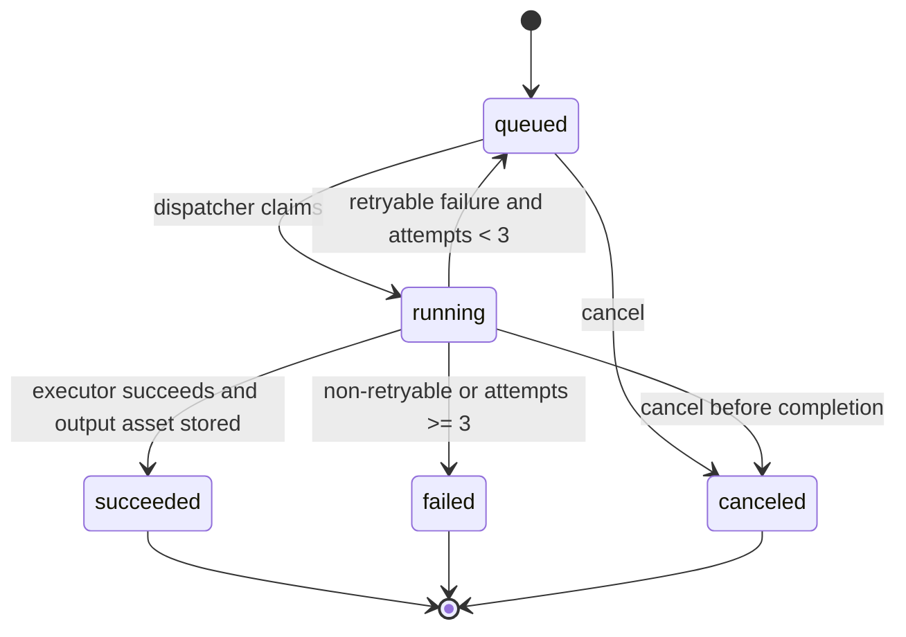

# 实现协议

## 约束来源

- `docs/iterations/ltx-video-service/architecture.md`: 模块划分、API 契约、数据模型、状态机、非功能要求。
- `docs/iterations/ltx-video-service/arch_decisions.md`: D16 明确 Phase 1 只交付非 GPU 控制面；D19 明确 Phase 2 可先用本地共享存储并保持 `ObjectStorageAdapter` 边界。
- `docs/iterations/ltx-video-service/tasks.md`: Phase 1 P0/P1 任务、Phase 2 T-201 验收标准和依赖。

## Phase 1 范围

Phase 1 只实现 web/control 节点能力：

- FastAPI API-only 接入。
- API Key 认证与资源隔离。
- ObjectStorageAdapter，默认本地文件实现，可作为 MinIO/S3 适配边界。
- Workflow Service，保存 T2V/I2V 模板、profile、source workflow 和 API Format。
- Task Service，状态机、attempt、幂等、重试、错误分类。
- QueueAdapter/Dispatcher，Phase 1 使用 Postgres/SQL 数据库领取 queued task。
- ExecutorAdapter，Phase 1 使用 mock/local executor。
- Usage Ledger，记录 task/profile/attempt/result/runtime。
- Internal Admin/Test Console 和 Admin JSON API。
- 控制面健康检查与 metrics。

Phase 1 禁止实现：

- GPU 服务器、GPU Worker、Worker Registry、ComfyUI/LTX 真实执行、Kubernetes/GPU Operator、DCGM。

## Phase 2 T-201 范围

T-201 只实现运行配置与共享存储边界：

- `Settings.storage_backend` 支持 `local_shared` 和 `minio` 配置值。
- `local_shared` 是当前可运行后端，输入图和输出视频都必须经 `ObjectStorageAdapter` 生成 `storage_uri` 并读写。
- `minio` 作为后续 T-302 生产对象存储切换的配置边界；当前 adapter 可构建，但真实运行依赖 MinIO SDK 和 MinIO 服务。
- `/health` 必须用写入型探针发现本地共享目录不可写，并返回 `storage=failed`。
- 外部 API、asset metadata 和 health detail 不得暴露本地文件系统路径。
- 存储异常发生在输出写入前时，任务不能被标记为 `succeeded`。

T-201 禁止实现：

- Worker Registry、GPU Dispatcher、GPU Worker Adapter、ComfyUI/LTX 真实执行、`gpu_server/` 部署目录。

## Phase 2 T-202 范围

T-202 只实现 Worker Registry 数据模型与内部 API：

- 新增 `gpu_nodes` 和 `gpu_workers` 数据模型。
- `POST /internal/workers/register` 使用 Worker service token 注册 Worker，并按 `worker_name` 幂等返回稳定 `worker_id`。
- `POST /internal/workers/{worker_id}/heartbeat` 更新 status、queue_depth、capabilities、current_attempt_id、metrics_url 和 last_heartbeat_at。
- `/admin/workers` 返回 Worker 列表、GPU index、状态、心跳延迟、queue_depth、当前 attempt。
- 心跳超时 Worker 标记为 `offline`，并从 `list_available_workers(...)` 中排除，供 T-203 Dispatcher 复用。
- Worker 内部 API 通过 `X-Worker-Token` 认证，缺失返回 401，错误返回 403。

T-202 禁止实现：

- queued task 派发到 GPU Worker、Worker Adapter 调用 ComfyUI、真实 GPU E2E、`gpu_server/` 部署。

## Phase 2 T-203 范围

T-203 只实现 GPU Dispatcher 与 ExecutorAdapter 派发边界：

- `Settings.executor_backend` 支持 `mock-local` 和 `gpu-worker`。
- `mock-local` 保持 Phase 1 同步 mock 执行路径不变。
- `gpu-worker` 模式下，Dispatcher 从 `list_available_workers(...)` 选择 capabilities 匹配 mode/profile 的 idle Worker。
- 派发成功后 task 进入 `running`，attempt 记录 `worker_id`，Worker 标记 busy 并记录 current_attempt_id。
- 无可用 Worker 时 task 保持 `queued`，error_code 为 `CAPACITY_UNAVAILABLE`，Admin/Metrics 可见。
- Worker assign 失败时 attempt 标记 failed；retryable 错误重新 queued，non-retryable 错误进入 failed 并记录 usage。
- 同一 task 已从 queued 转出后，再次 dispatch 不会创建第二个 attempt。
- `/internal/dispatch/complete-running` 只完成 `mock-local` attempt；`gpu-worker` attempt 等待后续 Worker event 回调。

T-203 禁止实现：

- 真实 Worker Adapter HTTP 调用、ComfyUI/LTX 执行、attempt event 回调、`gpu_server/` 部署。

## Phase 2 T-204 范围

T-204 只实现 `gpu_server/` 部署子项目骨架：

- `gpu_server/README.md` 说明 GPU 服务器前置条件、配置项、部署命令、健康检查和卸载方式。
- `gpu_server/.env.example` 包含 `CONTROL_PLANE_URL`、`WORKER_COUNT`、`GPU_INDICES`、`MODEL_DIR`、`STORAGE_DIR`、`WORKER_TOKEN`。
- `gpu_server/Dockerfile` 使用 CUDA 基础镜像，并固定 ComfyUI、ComfyUI-LTXVideo 的 git commit 和 PyTorch CUDA 12.8 版本。
- `gpu_server/control.Dockerfile` 允许同机部署 FastAPI control plane。
- `gpu_server/docker-compose.yml` 定义 control plane 和 8 个单 GPU Worker service，每个 Worker 固定唯一 `device_ids`。
- `scripts/deploy.sh` 在部署前检查 `nvidia-smi`、Docker Compose 和 Docker GPU runtime。
- `scripts/healthcheck.sh` 检查 GPU 可见性、control plane `/health` 和 Admin Worker 列表。
- `worker_adapter/runtime.py` 只做注册/心跳骨架，默认 `WORKER_STATUS=unhealthy`，避免真实 LTX Adapter 完成前被 Dispatcher 派发任务。

T-204 禁止实现：

- LTX 2.3 真实 Workflow API JSON、模型下载清单、ComfyUI `/prompt` 调用、attempt event 回调、真实视频生成。

## Phase 2 T-205 范围

T-205 只实现 LTX 2.3 distilled single-stage workflow 与模型缓存边界：

- `gpu_server/scripts/download_models.sh` 必须校验 workflow 使用的 checkpoint、LoRA 和 Gemma text encoder 文件是否存在。
- Worker 模型挂载路径必须对齐 ComfyUI 默认模型目录 `/opt/comfyui/models`。
- 首个 workflow 使用官方 ComfyUI-LTXVideo `2.3/LTX-2.3_T2V_I2V_Single_Stage_Distilled_Full.json`。
- Worker 必须能把官方 ComfyUI save-format workflow 转成 `/prompt` 可提交的 API Format。
- 模型缺失时必须保持 Worker 非 idle，并在脚本输出缺失清单。

T-205 禁止实现：

- two-stage/upscale profile、自由 workflow 编辑、多 workflow 自动选择。

## Phase 2 T-206 范围

T-206 只实现 GPU Worker Adapter 到 ComfyUI API 的执行边界：

- Worker 注册 capabilities 时带 `assign_url`，control plane 派发 attempt 时同步 POST 到该地址。
- assignment payload 必须包含 attempt_id、task_id、mode、profile、workflow_version_id、request_params、input_asset 和 output storage URI。
- Worker Adapter 暴露内部 `/worker/attempts`，接收 attempt 后异步执行，不能阻塞 Dispatcher。
- Worker Adapter 调用 ComfyUI `/prompt`，轮询 `/history/{prompt_id}`，通过 `/view` 读取输出视频。
- Worker 将输出视频写入 `ObjectStorageAdapter` 对齐的 `local://` 共享存储 URI。
- Worker 通过 `POST /internal/attempts/{attempt_id}/events` 回传 progress、succeeded 或 failed。
- Control plane 处理 succeeded event 时创建 output asset、标记 task/attempt 成功并写 usage ledger。
- Control plane 处理 failed event 时按 retryable/non-retryable 错误分类进入重试或终态失败。

T-206 禁止实现：

- WebSocket 精细进度、真实 GPU 秒采集、DCGM/Prometheus、8 Worker 并发 E2E 验收。

## 技术栈

- Python 3.12
- FastAPI
- SQLAlchemy
- Pydantic
- pytest + FastAPI TestClient

本地实现默认使用 SQLite 与本地文件对象存储，代码边界保留 PostgreSQL/MinIO 演进能力。

## 模块到代码目录

| 模块 | 代码目录 |
|---|---|
| Edge Gateway / API Key Auth | `src/ltx_service/api.py`, `src/ltx_service/security.py` |
| Task Service / QueueAdapter | `src/ltx_service/tasks.py` |
| ExecutorAdapter mock/local | `src/ltx_service/executor.py` |
| Workflow Service | `src/ltx_service/workflows.py` |
| Asset Service / ObjectStorageAdapter | `src/ltx_service/assets.py`, `src/ltx_service/storage.py` |
| Usage Ledger | `src/ltx_service/usage.py` |
| Admin | `src/ltx_service/api.py` |
| Data Models | `src/ltx_service/models.py` |
| App Composition | `src/ltx_service/app.py` |
| Runtime Config | `src/ltx_service/config.py` |
| Worker Registry | `src/ltx_service/worker_registry.py`, `src/ltx_service/models.py`, `src/ltx_service/api.py` |
| GPU Dispatcher / ExecutorAdapter | `src/ltx_service/tasks.py`, `src/ltx_service/executor.py` |
| GPU Server 部署子项目 | `gpu_server/` |

## 状态机

## API 契约

External API:

- `POST /v1/assets/uploads`
- `PUT /v1/assets/{asset_id}/content`
- `GET /v1/assets/{asset_id}/content`
- `POST /v1/video-generations`
- `GET /v1/video-generations/{task_id}`
- `POST /v1/video-generations/{task_id}/cancel`
- `GET /v1/video-generations/{task_id}/result`

Internal/Admin:

- `POST /internal/dispatch/run-once`
- `POST /internal/dispatch/complete-running`
- `GET /admin`
- `GET /admin/tasks`
- `POST /admin/tasks/{task_id}/retry`
- `GET /admin/workflow-templates`
- `POST /admin/workflow-versions`
- `POST /admin/workflow-versions/{id}/test`
- `POST /admin/workflow-versions/{id}/publish`
- `POST /admin/workflow-versions/{id}/rollback`
- `GET /admin/workers`
- `GET /admin/usage`
- `GET /health`
- `GET /metrics`
- `POST /internal/workers/register`
- `POST /internal/workers/{worker_id}/heartbeat`
- `POST /internal/attempts/{attempt_id}/events`

## 测试矩阵

| 场景 | 输入 | 预期输出 | 边界 |
|---|---|---|---|
| API Key 正常 | `Authorization: Bearer <valid>` | 允许访问 | F-001 |
| API Key 无效 | invalid bearer | 401 `AUTH_INVALID_API_KEY` | F-001 |
| 停用 Key | disabled key | 403 `AUTH_KEY_DISABLED` | F-001 |
| 创建上传槽 | filename/content_type/size | asset_id + upload_url | F-008 |
| 上传并读取资产 | PUT/GET asset content | bytes roundtrip | F-008 |
| 图生缺图 | `mode=image_to_video` no image | 422 `REQUEST_IMAGE_REQUIRED` | F-003 |
| 幂等提交 | same API key + Idempotency-Key | same task_id | F-004 |
| queued -> running -> succeeded | run-once + complete-running | status transitions and result asset | F-004/F-009 |
| cancel queued task | cancel endpoint | `canceled` status | F-004 |
| retryable failure | mock transient once | new attempt, then success | F-009 |
| invalid_input | mock invalid | failed, no retry | F-009 |
| usage ledger | completed task | profile/runtime/attempt/result recorded | F-010 |
| Admin access | valid admin token | tasks/workflows/usage visible | F-011 |
| Admin forbidden | missing token | 401/403 | F-011 |
| Health | services available | db/storage/executor healthy | F-012 |
| Metrics | tasks exist | text metrics include task counts | F-012 |
| T-201 local_shared URI boundary | local_shared backend + asset upload + output | input/output `storage_uri` uses adapter URI and does not expose local path | F-008/F-010 |
| T-201 storage health failure | local_shared root points to invalid file path | `/health` returns degraded and `storage=failed` | F-008 |
| T-201 output write failure | storage write fails before task completion | completion fails and task remains non-succeeded | F-008/F-009 |
| T-201 minio required env | `LTX_REQUIRE_ENV=true`, backend `minio`, missing MinIO vars | RuntimeError lists missing MinIO env vars | F-008 |
| T-202 worker register | 8 register payloads with valid `X-Worker-Token` | 8 stable worker records and Admin list | F-007/F-012 |
| T-202 duplicate register | same `worker_name` registered again | same `worker_id`, no duplicate available worker | F-007 |
| T-202 heartbeat | busy heartbeat with queue/current attempt | Worker status, queue_depth, capabilities, current_attempt updated | F-007/F-012 |
| T-202 stale heartbeat | last heartbeat older than timeout | Worker marked offline and unavailable | F-007 |
| T-202 worker token missing | register without `X-Worker-Token` | 401 `WORKER_TOKEN_REQUIRED` | F-007 |
| T-202 worker token invalid | register with wrong token | 403 `WORKER_FORBIDDEN` | F-007 |
| T-203 gpu-worker capacity unavailable | gpu-worker backend with queued task and no idle worker | task remains queued, reason `CAPACITY_UNAVAILABLE`, Admin/Metrics visible | F-004/F-007 |
| T-203 matching worker dispatch | fast task + mixed worker profiles | matching worker busy, attempt records worker_id, task running | F-004/F-007 |
| T-203 idempotent dispatch | dispatch same task twice | second dispatch creates no second attempt | F-009 |
| T-203 retryable assign failure | assign transient failure | attempt failed, task requeued | F-009 |
| T-203 non-retryable assign failure | assign invalid failure | task failed and usage ledger records failed attempt | F-009/F-010 |
| T-203 legacy DB migration | existing task_attempts table lacks worker_id | startup adds nullable worker_id column | F-009 |
| T-203 mock completion guard | gpu-worker task is running, call complete-running | returns completed=false and task remains running | F-009 |
| T-204 required files | `gpu_server/` exists | README/env/Dockerfile/compose/scripts/worker_adapter present | F-005/F-007 |
| T-204 env contract | `.env.example` | required Phase 2 variables present | F-005/F-007 |
| T-204 pinned Docker refs | `gpu_server/Dockerfile` | ComfyUI and ComfyUI-LTXVideo refs are 40-char commits | F-005 |
| T-204 8 worker compose | `docker-compose.yml` | worker-0..worker-7 each has unique GPU index/device id | F-007 |
| T-204 GPU runtime fail-fast | deploy/health scripts | `nvidia-smi` and `docker run --gpus` checks exist | F-005/F-012 |
| T-205 model mount path | `docker-compose.yml` | host `MODEL_DIR` mounts to `/opt/comfyui/models` | F-005/F-008 |
| T-205 model cache check | `download_models.sh` | missing checkpoint/LoRA/Gemma files are listed and script fails | F-005/F-008 |
| T-206 assignment HTTP | worker has `assign_url` | Dispatcher POSTs assignment payload to worker and task enters running | F-005/F-007/F-009 |
| T-206 worker succeeded event | output URI exists | task/attempt succeeded, output asset created, usage ledger records runtime | F-004/F-008/F-010 |
| T-206 mock complete guard | gpu-worker task running | `/internal/dispatch/complete-running` still does not complete GPU task | F-009 |

## 还原检查清单

- [ ] Phase 1 不引入 GPU runtime 依赖。
- [ ] 所有 `/v1/*` API 需要 API Key。
- [ ] API Key 只存 hash。
- [ ] Task Service 通过 `ExecutorAdapter` 执行，不直接内联 mock 逻辑。
- [ ] Queue/dispatch 通过边界方法处理 queued/running。
- [ ] Object storage 通过 `ObjectStorageAdapter`。
- [ ] 输入图和输出视频的 `storage_uri` 由 `ObjectStorageAdapter.uri_for` 生成。
- [ ] `local_shared` health probe 验证目录可写，不泄露本地路径。
- [ ] `minio` 配置边界存在，缺少必要配置时快速失败并列出变量名。
- [ ] Worker Registry 数据模型包含 node、worker、capabilities、queue_depth、last_heartbeat、metrics_url。
- [ ] Worker register/heartbeat 内部 API 使用 service token。
- [ ] Admin workers 输出可用于观察 8 Worker 状态。
- [ ] Stale Worker 不会出现在可用 Worker 查询中。
- [ ] Executor backend 可配置为 `mock-local` 或 `gpu-worker`。
- [ ] gpu-worker dispatch 只选择 capabilities 匹配的 idle Worker。
- [ ] GPU attempt 记录 worker_id，且同一 task 不会被重复派发。
- [ ] 容量不足和 assign 失败路径可被 Admin/Metrics 观察。
- [ ] `gpu_server/` 提供 clone 后可进入目录部署的入口。
- [ ] GPU Worker Dockerfile 固定 ComfyUI/ComfyUI-LTXVideo 上游版本。
- [ ] Compose 中 8 个 Worker 与 GPU index 一一对应。
- [ ] 部署脚本在 GPU 不可见或 Docker GPU runtime 不可用时快速失败。
- [ ] T-204 worker skeleton 默认不注册为 idle，避免真实执行能力未完成前吞任务。
- [ ] T-205 模型目录挂载到 ComfyUI 默认 `/opt/comfyui/models`。
- [ ] T-205 模型下载脚本能快速暴露缺失 checkpoint/LoRA/Gemma 文件。
- [ ] T-206 Worker assignment 通过 HTTP 边界进入 Worker Adapter。
- [ ] T-206 Worker event 回调是 GPU task 进入 succeeded/failed 的唯一完成路径。
- [ ] Workflow 保存 source 和 API JSON。
- [ ] Usage ledger 与 task completion 同步写入。
- [ ] Tests 覆盖正常路径和异常路径。
