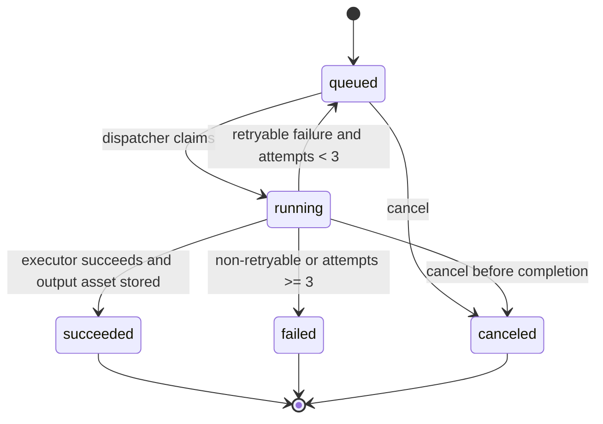

# 实现协议

## 约束来源

- `docs/iterations/ltx-video-service/architecture.md`: 模块划分、API 契约、数据模型、状态机、非功能要求。
- `docs/iterations/ltx-video-service/arch_decisions.md`: D16 明确 Phase 1 只交付非 GPU 控制面。
- `docs/iterations/ltx-video-service/tasks.md`: Phase 1 P0/P1 任务、验收标准和依赖。

## Phase 1 范围

Phase 1 只实现 web/control 节点能力：

- FastAPI API-only 接入。
- API Key 认证与资源隔离。
- ObjectStorageAdapter，默认本地文件实现，可作为 MinIO/S3 适配边界。
- Workflow Service，保存 T2V/I2V 模板、profile、source workflow 和 API Format。
- Task Service，状态机、attempt、幂等、重试、错误分类。
- QueueAdapter/Dispatcher，Phase 1 使用 Postgres/SQL 数据库领取 queued task。
- ExecutorAdapter，Phase 1 使用 mock/local executor。
- Usage Ledger，记录 task/profile/attempt/result/runtime。
- Internal Admin/Test Console 和 Admin JSON API。
- 控制面健康检查与 metrics。

Phase 1 禁止实现：

- GPU 服务器、GPU Worker、Worker Registry、ComfyUI/LTX 真实执行、Kubernetes/GPU Operator、DCGM。

## 技术栈

- Python 3.12
- FastAPI
- SQLAlchemy
- Pydantic
- pytest + FastAPI TestClient

本地实现默认使用 SQLite 与本地文件对象存储，代码边界保留 PostgreSQL/MinIO 演进能力。

## 模块到代码目录

| 模块 | 代码目录 |
|---|---|
| Edge Gateway / API Key Auth | `src/ltx_service/api.py`, `src/ltx_service/security.py` |
| Task Service / QueueAdapter | `src/ltx_service/tasks.py` |
| ExecutorAdapter mock/local | `src/ltx_service/executor.py` |
| Workflow Service | `src/ltx_service/workflows.py` |
| Asset Service / ObjectStorageAdapter | `src/ltx_service/assets.py`, `src/ltx_service/storage.py` |
| Usage Ledger | `src/ltx_service/usage.py` |
| Admin | `src/ltx_service/api.py` |
| Data Models | `src/ltx_service/models.py` |
| App Composition | `src/ltx_service/app.py` |

## 状态机

## API 契约

External API:

- `POST /v1/assets/uploads`
- `PUT /v1/assets/{asset_id}/content`
- `GET /v1/assets/{asset_id}/content`
- `POST /v1/video-generations`
- `GET /v1/video-generations/{task_id}`
- `POST /v1/video-generations/{task_id}/cancel`
- `GET /v1/video-generations/{task_id}/result`

Internal/Admin:

- `POST /internal/dispatch/run-once`
- `POST /internal/dispatch/complete-running`
- `GET /admin`
- `GET /admin/tasks`
- `POST /admin/tasks/{task_id}/retry`
- `GET /admin/workflow-templates`
- `POST /admin/workflow-versions`
- `POST /admin/workflow-versions/{id}/test`
- `POST /admin/workflow-versions/{id}/publish`
- `POST /admin/workflow-versions/{id}/rollback`
- `GET /admin/workers`
- `GET /admin/usage`
- `GET /health`
- `GET /metrics`

## 测试矩阵

| 场景 | 输入 | 预期输出 | 边界 |
|---|---|---|---|
| API Key 正常 | `Authorization: Bearer <valid>` | 允许访问 | F-001 |
| API Key 无效 | invalid bearer | 401 `AUTH_INVALID_API_KEY` | F-001 |
| 停用 Key | disabled key | 403 `AUTH_KEY_DISABLED` | F-001 |
| 创建上传槽 | filename/content_type/size | asset_id + upload_url | F-008 |
| 上传并读取资产 | PUT/GET asset content | bytes roundtrip | F-008 |
| 图生缺图 | `mode=image_to_video` no image | 422 `REQUEST_IMAGE_REQUIRED` | F-003 |
| 幂等提交 | same API key + Idempotency-Key | same task_id | F-004 |
| queued -> running -> succeeded | run-once + complete-running | status transitions and result asset | F-004/F-009 |
| cancel queued task | cancel endpoint | `canceled` status | F-004 |
| retryable failure | mock transient once | new attempt, then success | F-009 |
| invalid_input | mock invalid | failed, no retry | F-009 |
| usage ledger | completed task | profile/runtime/attempt/result recorded | F-010 |
| Admin access | valid admin token | tasks/workflows/usage visible | F-011 |
| Admin forbidden | missing token | 401/403 | F-011 |
| Health | services available | db/storage/executor healthy | F-012 |
| Metrics | tasks exist | text metrics include task counts | F-012 |

## 还原检查清单

- [ ] Phase 1 不引入 GPU runtime 依赖。
- [ ] 所有 `/v1/*` API 需要 API Key。
- [ ] API Key 只存 hash。
- [ ] Task Service 通过 `ExecutorAdapter` 执行，不直接内联 mock 逻辑。
- [ ] Queue/dispatch 通过边界方法处理 queued/running。
- [ ] Object storage 通过 `ObjectStorageAdapter`。
- [ ] Workflow 保存 source 和 API JSON。
- [ ] Usage ledger 与 task completion 同步写入。
- [ ] Tests 覆盖正常路径和异常路径。
