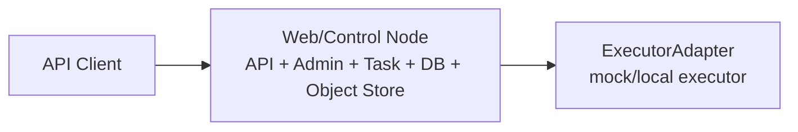
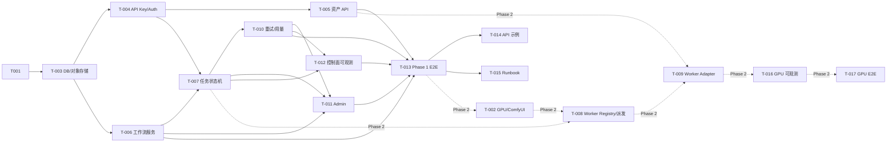

# 工程规划: LTX 2.3 MVP 测试环境

生成时间: 2026-07-13  
状态: DRAFT  
关联架构: [architecture.md](architecture.md)  
关联决策: [arch_decisions.md](arch_decisions.md)

> ⚠️ 前置门禁跳过: 当前缺少 `feature-specs/` 和 `review-logs/arch_review.md`。本规划基于 `architecture.md`、`arch_decisions.md` 和用户新增 MVP 目标生成。它可作为第一阶段实施草案，严格的 implementing 合同仍建议后续补齐 feature specs 或完成 review。

## 1. 规划概要

### 1.1 目标

搭建第一阶段 MVP 测试环境：先完成 1 个 web/control 节点上的非 GPU 控制面，不处理 GPU 服务器、GPU Worker、ComfyUI/LTX 真实执行和 GPU 调度逻辑。第一阶段必须跑通 API-only、资产、工作流、任务状态机、重试、计数、内部管理和控制面基础观测。

本 MVP 不是临时版本，而是中期目标架构的第一段可运行切片。实现可以先不接 GPU，但代码边界必须与中期架构一致：`Edge Gateway`、`QueueAdapter/Dispatcher`、`ObjectStorageAdapter`、`ExecutorAdapter` 从第一版就存在。Phase 2 再把 `ExecutorAdapter` 的实现替换为 GPU Worker/ComfyUI。

### 1.2 MVP 拓扑

Phase 1 推荐拓扑:



最小可接受拓扑:

- **Phase 1 推荐**: 1 台 web/control 节点，运行 API、Admin、PostgreSQL、MinIO、Task/Workflow/Asset/Usage 服务。
- **Phase 1 验收口径**: 不接 GPU；用 mock/local executor 验证任务状态、attempt、重试、计数和 Admin。
- **Phase 2 推荐**: 增加至少 1 台 GPU 服务节点，接入 K8s/GPU Operator、ComfyUI/LTX Worker 和真实 GPU E2E。

### 1.3 中期目标与 MVP 切片

| 能力 | Phase 1 实现 | Phase 2 / 中期演进 | Phase 1 必须保持的边界 |
|---|---|---|---|
| API 接入 | FastAPI 内置认证、限流、错误码 | Kong 或等价 API Gateway | `/v1/*` API 契约、API Key 语义不变 |
| 队列/派发 | Postgres Dispatcher | Redis Streams/Temporal + KEDA | `QueueAdapter/Dispatcher` 边界不变 |
| 对象存储 | MinIO | S3/OSS/自建对象存储 | `ObjectStorageAdapter` 边界不变 |
| 执行后端 | ExecutorAdapter mock/local | GPU Worker + ComfyUI Server API | task_id、attempt、error_class、usage ledger 不变 |
| 工作流 | 保存 T2V/I2V 模板元数据与 API Format | 真实 LTX workflow 校验和执行 | source workflow + API Format 双格式不变 |
| 监控 | 控制面健康、任务指标、错误分布 | GPU/DCGM、Worker 指标、SLO | 指标命名和标签维度稳定 |

当前不允许为了快而绕过这些边界。例如：不能把任务状态只存在内存里，不能让 workflow JSON 散落在脚本中，不能把 mock executor 写死在 Task Service 内部。

### 1.4 范围

- Phase 1 P0 任务: 10 个
- Phase 1 P1 任务: 2 个
- Phase 2 任务: 5 个，规划但当前不做
- Phase 1 总预估: 16 人天
- Phase 1 单人串行预估: 13-16 工作日
- Phase 1 2 人并行预估: 7-9 工作日

### 1.5 关键路径

关键路径决定最短交付时间：

```text
T-001 -> T-003 -> T-004 -> T-007 -> T-010 -> T-013
```

可并行任务组：

- T-003、T-004、T-005 可在 T-001 后并行。
- T-006 可在 T-003 后独立推进。
- T-011、T-012 可在核心 API 和任务状态机稳定后并行。
- T-014、T-015 为 P1，不阻塞 MVP 核心链路。

## 2. 任务概览

| Task ID | 名称 | 优先级 | 关联 Feature | 关联组件 | 依赖 | 预估 | 状态 |
|---|---|---|---|---|---|---:|---|
| T-001 | Phase 1 环境边界与配置基线 | P0 | F-001, F-008 | 配置/部署 | - | 1d | TODO |
| T-003 | 数据库与对象存储测试底座 | P0 | F-008, F-010 | PostgreSQL, Object Storage Adapter | T-001 | 1.5d | TODO |
| T-004 | API 服务骨架与 API Key 认证 | P0 | F-001 | API Gateway | T-001, T-003 | 1.5d | TODO |
| T-005 | 资产上传与结果访问 API | P0 | F-003, F-008 | Asset Service | T-003, T-004 | 1d | TODO |
| T-006 | LTX 工作流模板与版本服务 | P0 | F-002, F-003, F-006 | Workflow Service | T-003 | 2d | TODO |
| T-007 | 任务 API 与状态机 | P0 | F-004, F-009 | Task Service | T-004, T-006 | 2d | TODO |
| T-010 | 重试、attempt 与用量账本 | P0 | F-009, F-010 | Task Service, Usage Ledger, ExecutorAdapter | T-007 | 1d | TODO |
| T-011 | 内部管理 Web/Admin | P0 | F-006, F-011 | Internal Admin | T-006, T-007, T-010 | 2d | TODO |
| T-012 | Phase 1 控制面可观测性与健康检查 | P0 | F-004, F-009, F-010 | Observability | T-007, T-010 | 1d | TODO |
| T-013 | Phase 1 端到端验收与失败演练 | P0 | F-001, F-003, F-004, F-006, F-009, F-010, F-011 | 控制面全链路 | T-005, T-006, T-010, T-011, T-012 | 2d | TODO |
| T-014 | API 调用说明与示例脚本 | P1 | F-001, F-002, F-003, F-004 | DX 文档 | T-013 | 1d | TODO |
| T-015 | Phase 1 部署 Runbook | P1 | F-001, F-008, F-011 | 运维文档 | T-013 | 1d | TODO |
| T-002 | Phase 2 GPU 节点与 ComfyUI/LTX 基础运行 | P2 | F-005, F-007 | Kubernetes, GPU Worker, ComfyUI | Phase 1 完成 | 2d | TODO |
| T-008 | Phase 2 Worker Registry 与 GPU 任务派发 | P2 | F-007, F-009, F-012 | Worker Registry, Dispatcher | T-002, T-007 | 1.5d | TODO |
| T-009 | Phase 2 GPU Worker Adapter 接入 ComfyUI API | P2 | F-002, F-003, F-005, F-008 | GPU Worker Adapter, ComfyUI | T-002, T-005, T-008 | 2d | TODO |
| T-016 | Phase 2 GPU 可观测性 | P2 | F-012 | DCGM Exporter, Worker Metrics | T-008, T-009 | 1d | TODO |
| T-017 | Phase 2 真实 GPU E2E 验收 | P2 | F-002, F-003, F-005, F-007, F-012 | GPU 全链路 | T-009, T-016 | 2d | TODO |

P2 当前不做:

| Task ID | 名称 | 原因 |
|---|---|---|
| P2-001 | 多 GPU 节点自动扩容 | 第一阶段静态容量池 |
| P2-002 | 组织/团队权限 | 第一阶段只做 API Key 隔离 |
| P2-003 | 复杂价格系统 | 第一阶段只记录用量账本 |
| P2-004 | 外部 Web 用户界面 | 第一阶段对外 API-only |
| P2-005 | 用户自由编辑 ComfyUI 节点图 | 第一阶段只开放参数化模板 |
| P2-006 | Kong Gateway | 中期接入层目标；MVP 保持 Edge Gateway 接口但不引入运行件 |
| P2-007 | Redis/Temporal 队列 | 中期队列目标；MVP 通过 QueueAdapter 使用 Postgres Dispatcher |
| P2-008 | KEDA 自动扩缩容 | Scale 阶段目标；MVP 常驻 Worker 更适合模型预热 |

## 3. 任务依赖图



依赖图无循环。

## 4. 任务详情

### T-001: Phase 1 环境边界与配置基线

- **优先级**: P0
- **关联 Feature**: F-001, F-008
- **关联组件**: 配置/部署
- **目标**: 明确 Phase 1 web/control 节点的网络、域名、密钥、目录和运行参数。
- **实现方案**:
  - 方案 A: 1 个 web/control 节点运行 API、Admin、DB、MinIO 和 mock/local executor。推荐，理由: 符合最新 Phase 1 边界，最小化 GPU 外部依赖。
  - 方案 B: 预留 GPU 节点配置但不启用。当前不推荐，理由: 容易让 Phase 1 验收误入 GPU 范围。
- **验收标准**:
  - [ ] 存在一份环境配置清单，包含 web/control 节点地址、对象存储端点、数据库连接、Admin 内部访问地址。
  - [ ] 配置清单明确 Phase 1 运行件: FastAPI、PostgreSQL、MinIO、控制面 metrics、mock/local executor。
  - [ ] 配置清单明确 Phase 2 后置运行件: Kubernetes/k3s、NVIDIA GPU Operator、ComfyUI、ComfyUI-LTXVideo、DCGM Exporter、GPU Worker Adapter。
  - [ ] 配置清单明确中期后置运行件: Kong、Redis/Temporal、KEDA。
  - [ ] API Key、内部 service token、对象存储凭据以环境变量或 secret 管理，仓库中不出现明文密钥。
  - [ ] 异常路径: 缺少必需环境变量时服务启动失败，并输出缺失变量名。
- **依赖**: 无
- **预估**: 1d
- **约束来源**: architecture.md § 1.3, § 3.3, § 8.4; arch_decisions.md D02, D07, D11

### T-002: Phase 2 GPU 节点与 ComfyUI/LTX 基础运行

- **优先级**: P2
- **关联 Feature**: F-005, F-007
- **关联组件**: Kubernetes, GPU Worker, ComfyUI
- **目标**: 在至少 1 台 GPU 机器上启动 ComfyUI + LTX 2.3，并验证 ComfyUI Server API 可用。
- **实现方案**:
  - 方案 A: 轻量 Kubernetes/k3s + NVIDIA GPU Operator。推荐，理由: 与架构一致，后续增加节点成本低。
  - 方案 B: Docker Compose + NVIDIA Container Toolkit。只适合快速单机验证，后续迁移到 K8s 会返工。
- **验收标准**:
  - [ ] GPU 节点能通过容器访问 NVIDIA GPU。
  - [ ] ComfyUI 以 headless 服务启动，不要求打开 ComfyUI 原生 UI。
  - [ ] LTX 2.3 模型文件位于节点本地 NVMe/PVC 缓存路径。
  - [ ] 调用 ComfyUI `/prompt` 可接受一个最小 API Format workflow。
  - [ ] 异常路径: GPU 不可见或模型文件缺失时，Worker 不注册为可用。
- **依赖**: Phase 1 完成
- **预估**: 2d
- **约束来源**: architecture.md § 2.2, § 3.2, § 8.1; arch_decisions.md D05, D06, D07, D11

### T-003: 数据库与对象存储测试底座

- **优先级**: P0
- **关联 Feature**: F-008, F-010
- **关联组件**: PostgreSQL, Object Storage Adapter
- **目标**: 提供 MVP 所需业务状态源和输入输出资产存储。
- **实现方案**:
  - 方案 A: Web/control 节点本地部署 PostgreSQL + MinIO 或兼容对象存储。推荐，理由: 测试环境可控，成本低。
  - 方案 B: 使用外部托管数据库和对象存储。适合已有基础设施，但依赖网络和权限配置。
- **验收标准**:
  - [ ] 数据库包含 architecture.md § 5 中的核心表: api_keys、workflow_templates、workflow_versions、workflow_profiles、video_tasks、task_attempts、task_assets、gpu_nodes、gpu_workers、usage_ledger。
  - [ ] MVP 默认对象存储实现为 MinIO。
  - [ ] 业务代码只依赖 ObjectStorageAdapter，不直接依赖 MinIO SDK 细节。
  - [ ] 对象存储适配器能写入输入图、输出视频和日志附件。
  - [ ] task_assets 记录的 storage_uri 可被后端解析并生成临时访问地址。
  - [ ] 异常路径: 对象存储写入失败时，API 返回明确错误，不创建不可恢复的半成品任务。
- **依赖**: T-001
- **预估**: 1.5d
- **约束来源**: architecture.md § 5, § 8.3, § 8.6; arch_decisions.md D10, D11, D12

### T-004: API 服务骨架与 API Key 认证

- **优先级**: P0
- **关联 Feature**: F-001
- **关联组件**: API Gateway
- **目标**: 建立外部 API 入口，并完成 API Key 认证和统一错误返回。
- **实现方案**:
  - 方案 A: 单体 Web/API 服务内实现 Gateway、Task、Asset、Workflow 模块。推荐，理由: MVP 最小服务数量，部署简单。
  - 方案 B: 拆成多个微服务。当前不推荐，理由: MVP 阶段增加部署和调试成本。
- **验收标准**:
  - [ ] 所有 `/v1/*` 外部 API 要求 `Authorization: Bearer <api_key>`。
  - [ ] API 入口代码按 Edge Gateway 边界组织，后续可在前面接 Kong 而不修改 `/v1/*` handler 语义。
  - [ ] API Key 只存 hash，不存明文。
  - [ ] 无效 API Key 返回 401 和 `AUTH_INVALID_API_KEY`。
  - [ ] 被停用 API Key 返回 403 和 `AUTH_KEY_DISABLED`。
  - [ ] 健康检查接口不泄露内部配置和密钥。
- **依赖**: T-001, T-003
- **预估**: 1.5d
- **约束来源**: architecture.md § 6.1, § 6.4, § 8.4; arch_decisions.md D02

### T-005: 资产上传与结果访问 API

- **优先级**: P0
- **关联 Feature**: F-003, F-008
- **关联组件**: Asset Service
- **目标**: 支持图生视频输入图上传和生成结果下载。
- **实现方案**:
  - 方案 A: 后端生成短期上传/下载 URL。推荐，理由: 不暴露对象存储长期凭据。
  - 方案 B: 文件经后端流式代理。适合对象存储不支持签名 URL，但会增加 web 节点带宽压力。
- **验收标准**:
  - [ ] `POST /v1/assets/uploads` 返回 asset_id、upload_url、expires_at。
  - [ ] 上传完成后的 asset_id 可用于图生视频任务。
  - [ ] 结果资产可通过 `GET /v1/video-generations/{task_id}/result` 获得临时下载地址。
  - [ ] 非当前 API Key 所属任务的资产不能被访问。
  - [ ] 异常路径: 不支持的 content_type 返回 422 和明确错误码。
- **依赖**: T-003, T-004
- **预估**: 1d
- **约束来源**: architecture.md § 6.1, § 8.4; arch_decisions.md D11

### T-006: LTX 工作流模板与版本服务

- **优先级**: P0
- **关联 Feature**: F-002, F-003, F-006
- **关联组件**: Workflow Service
- **目标**: 内置 LTX 文生视频和图生视频模板，并支持 draft/testing/published/rollback。
- **实现方案**:
  - 方案 A: 使用数据库保存 source_workflow_json、api_workflow_json 和 profile schema。推荐，理由: 符合架构且便于回滚。
  - 方案 B: 用文件保存 workflow JSON，数据库只存引用。可行但发布/回滚审计较弱。
- **验收标准**:
  - [ ] 至少存在 text_to_video 和 image_to_video 两个 workflow template。
  - [ ] 每个 template 至少有 fast 和 quality 两个 profile。
  - [ ] published 版本只能有一个当前生效版本。
  - [ ] draft 版本不能被外部任务直接执行。
  - [ ] rollback 后新任务使用回滚目标版本，历史任务仍引用原 workflow_version_id。
- **依赖**: T-003
- **预估**: 2d
- **约束来源**: architecture.md § 5.1, § 5.2, § 7.3; arch_decisions.md D05, D08

### T-007: 任务 API 与状态机

- **优先级**: P0
- **关联 Feature**: F-004, F-009
- **关联组件**: Task Service
- **目标**: 实现异步任务提交、状态查询、取消和结果状态。
- **实现方案**:
  - 方案 A: PostgreSQL 任务表 + 状态机 + dispatcher 轮询领取。推荐，理由: GPU 是瓶颈，MVP 不需要独立队列中间件。
  - 方案 B: 直接引入 Temporal/Redis Queue。当前不推荐，理由: 增加部署复杂度。
- **验收标准**:
  - [ ] Dispatcher 通过 QueueAdapter 边界读取和领取 queued 任务。
  - [ ] Task Service 通过 ExecutorAdapter 调用执行后端；Phase 1 使用 mock/local executor，不出现 GPU Worker 依赖。
  - [ ] `POST /v1/video-generations` 创建 queued 任务并返回 task_id。
  - [ ] `GET /v1/video-generations/{task_id}` 返回 queued/running/succeeded/failed/canceled 之一。
  - [ ] 文生视频任务不要求 image_asset_id。
  - [ ] 图生视频任务缺少 image_asset_id 时返回 422 和 `REQUEST_IMAGE_REQUIRED`。
  - [ ] 支持 `Idempotency-Key`，同一 API Key + 同一 key 重试提交返回同一 task_id。
  - [ ] 异常路径: 参数非法时不创建 task_attempts。
- **依赖**: T-004, T-006
- **预估**: 2d
- **约束来源**: architecture.md § 6.1, § 7.2, § 8.3; arch_decisions.md D03, D04, D12

### T-008: Phase 2 Worker Registry 与 GPU 任务派发

- **优先级**: P2
- **关联 Feature**: F-007, F-009, F-012
- **关联组件**: Worker Registry, Dispatcher
- **目标**: 让 GPU Worker 可注册、心跳、标记 busy/idle，并被任务派发器选择。
- **实现方案**:
  - 方案 A: Worker 主动注册 + 心跳，Dispatcher 从数据库选择 idle worker。推荐，理由: 简单、可观测、适合静态容量池。
  - 方案 B: 只通过 K8s Service 发现 Worker。当前不推荐，理由: 无法表达 GPU 能力、队列深度和业务健康。
- **验收标准**:
  - [ ] Worker 启动后调用 `/internal/workers/register` 并获得 worker_id。
  - [ ] Worker 定期上报 heartbeat、gpu_index、capabilities、queue_depth。
  - [ ] 心跳超时的 Worker 被标记为 unhealthy/offline，Dispatcher 不再派发新任务。
  - [ ] Dispatcher 只把任务派给 idle 且 capabilities 匹配 mode/profile 的 Worker。
  - [ ] Dispatcher 不直接依赖 K8s Pod 列表作为业务健康来源；K8s 只提供基础设施状态，业务可用性以 Worker Registry 为准。
  - [ ] 异常路径: 任务派发时无可用 Worker，任务保持 queued 或返回 `CAPACITY_UNAVAILABLE`，行为需配置明确。
- **依赖**: T-002, T-007
- **预估**: 1.5d
- **约束来源**: architecture.md § 6.3, § 7.1, § 8.2, § 8.6; arch_decisions.md D04, D06, D07

### T-009: Phase 2 GPU Worker Adapter 接入 ComfyUI API

- **优先级**: P2
- **关联 Feature**: F-002, F-003, F-005, F-008
- **关联组件**: GPU Worker Adapter, ComfyUI
- **目标**: Worker 接收业务 attempt，注入参数到 ComfyUI Workflow API Format，执行并回传结果。
- **实现方案**:
  - 方案 A: Worker Adapter 独立进程旁路调用本机 ComfyUI HTTP/WebSocket。推荐，理由: 与 ComfyUI 解耦，便于重启和观测。
  - 方案 B: 修改 ComfyUI 插件嵌入业务逻辑。当前不推荐，理由: 增加升级风险。
- **验收标准**:
  - [ ] Worker 能接收 assigned attempt 并调用 ComfyUI `/prompt`。
  - [ ] Worker 使用 WebSocket 监听进度，并通过 `/internal/attempts/{attempt_id}/events` 回传 stage/percent。
  - [ ] Worker 通过 History 获取输出文件并上传到对象存储。
  - [ ] Worker Adapter 不修改 ComfyUI 内核；业务逻辑只在 Adapter 中实现。
  - [ ] 文生视频和图生视频各能成功完成 1 个真实 LTX 任务。
  - [ ] 异常路径: ComfyUI prompt 校验失败时，attempt 标记 failed，error_class 为 invalid_input 或 comfyui_prompt_failed。
  - [ ] 异常路径: Worker 进程重启后，未完成 attempt 被 Task Service 判定为可恢复失败。
- **依赖**: T-002, T-005, T-008
- **预估**: 2d
- **约束来源**: architecture.md § 2.2, § 3.3, § 6.3, § 7.1; arch_decisions.md D05, D09, D11

### T-010: 重试、attempt 与用量账本

- **优先级**: P0
- **关联 Feature**: F-009, F-010
- **关联组件**: Task Service, Usage Ledger
- **目标**: 完成任务失败分类、最多 3 次 attempt 和 GPU 消耗记录。
- **实现方案**:
  - 方案 A: Task Service 统一处理错误分类、重试和 usage ledger。推荐，理由: 业务状态集中。
  - 方案 B: Worker 自己决定重试。当前不推荐，理由: Worker 不应控制全局任务策略。
- **验收标准**:
  - [ ] retryable failure 在 attempt_count < 3 时重新进入 queued。
  - [ ] invalid_input、policy_rejected 不重试，任务进入 failed。
  - [ ] mock/local executor 可以模拟 transient、worker_crash、invalid_input 三类错误。
  - [ ] GPU_OOM 只作为错误码预留，不在 Phase 1 触发真实 GPU 逻辑。
  - [ ] usage_ledger 记录 profile、estimated_gpu_seconds、actual_runtime_seconds 或 actual_gpu_seconds 空值、attempt_count、result。
  - [ ] 异常路径: usage ledger 写入失败时，任务不能被标记为 succeeded。
- **依赖**: T-007
- **预估**: 1d
- **约束来源**: architecture.md § 5.1, § 6.4, § 8.2, § 8.3; arch_decisions.md D09, D10

### T-011: 内部管理 Web/Admin

- **优先级**: P0
- **关联 Feature**: F-006, F-011
- **关联组件**: Internal Admin
- **目标**: 提供 MVP 内部管理能力，覆盖工作流、任务、失败重跑、Worker 和用量。
- **实现方案**:
  - 方案 A: 在同一 web/control 服务中提供简易 Admin Web 页面。推荐，理由: 满足“web 服务节点”目标且部署简单。
  - 方案 B: 只提供 Admin API，不做页面。可行但运维体验差，不满足“内部管理友好”的目标。
- **验收标准**:
  - [ ] Admin 能查看任务列表并按状态、mode、profile、error_code 过滤。
  - [ ] Admin 能对 failed 任务触发人工 retry，并形成新的 attempt。
  - [ ] Admin 能查看 workflow template/version/profile，并执行 publish/rollback。
  - [ ] Admin 能查看 ExecutorAdapter 当前实现类型为 mock/local。
  - [ ] Admin 能查看 API Key 维度的任务数、成功数、失败数、attempt_count、estimated_gpu_seconds 和 Phase 1 runtime。
  - [ ] 异常路径: 非内部 token 访问 Admin 返回 401/403。
- **依赖**: T-006, T-007, T-010
- **预估**: 2d
- **约束来源**: architecture.md § 6.2, § 8.4; arch_decisions.md D02, D08, D10, D13

### T-012: Phase 1 控制面可观测性与健康检查

- **优先级**: P0
- **关联 Feature**: F-004, F-009, F-010
- **关联组件**: Observability
- **目标**: Phase 1 上线前具备定位 API、任务状态、错误和对象存储问题的基本指标。
- **实现方案**:
  - 方案 A: 服务暴露 `/metrics`，用 Prometheus + Grafana 或兼容方案采集。推荐，理由: 标准、可扩展。
  - 方案 B: 只写结构化日志。可作为兜底，但无法满足 Worker 级指标硬要求。
- **验收标准**:
  - [ ] 暴露任务成功率、失败原因分布、平均生成耗时、attempt_count 分布。
  - [ ] 暴露 QueueAdapter queued/running/succeeded/failed 任务数。
  - [ ] 健康检查能区分 web 服务健康、数据库健康、对象存储健康、mock/local executor 健康。
  - [ ] 不采集 GPU 利用率、显存、DCGM、Worker 心跳；这些进入 Phase 2。
  - [ ] 异常路径: mock/local executor 被禁用时，任务保持 queued 或进入 failed，且 Admin 可见原因。
- **依赖**: T-007, T-010
- **预估**: 1d
- **约束来源**: architecture.md § 8.5; arch_decisions.md D13, D16

### T-013: Phase 1 端到端验收与失败演练

- **优先级**: P0
- **关联 Feature**: F-001, F-003, F-004, F-006, F-009, F-010, F-011
- **关联组件**: 控制面全链路
- **目标**: 证明 Phase 1 非 GPU 控制面完成闭环，不依赖 GPU 服务器。
- **实现方案**:
  - 方案 A: 编写一组自动化 smoke/e2e 脚本，覆盖 API、worker、admin 和失败演练。推荐，理由: 可重复验证。
  - 方案 B: 手工操作验收。当前不推荐，理由: 视频生成链路长，手工验收不可回归。
- **验收标准**:
  - [ ] 使用 API Key 提交 1 个文生视频任务，mock/local executor 最终将任务置为 succeeded，并返回模拟结果资产。
  - [ ] 使用 API Key 上传输入图并提交 1 个图生视频任务，mock/local executor 最终将任务置为 succeeded，并返回模拟结果资产。
  - [ ] 查询接口能看到 queued、running、succeeded/failed 状态变化。
  - [ ] 人为制造一次 retryable failure，任务最多 3 次 attempt 后成功或进入 failed 终态。
  - [ ] Admin 能看到任务、workflow、usage、executor 类型数据。
  - [ ] 对同一 API Key + Idempotency-Key 重复提交，返回同一个 task_id。
  - [ ] 无效 API Key、缺图、额度不足、executor 不可用都返回架构定义的错误码。
  - [ ] 验收不要求 ComfyUI、LTX、GPU、K8s、Worker Registry。
- **依赖**: T-005, T-006, T-010, T-011, T-012
- **预估**: 2d
- **约束来源**: architecture.md § 6, § 7.5, § 8.6, § 9; arch_decisions.md D01-D13

### T-014: API 调用说明与示例脚本

- **优先级**: P1
- **关联 Feature**: F-001, F-002, F-003, F-004
- **关联组件**: DX 文档
- **目标**: 让内部测试人员能用 curl 或脚本调用 MVP API。
- **实现方案**:
  - 方案 A: 提供 curl + Python 示例。推荐，理由: 最低成本。
  - 方案 B: 生成完整 SDK。当前不做，超出 MVP。
- **验收标准**:
  - [ ] 示例覆盖资产上传、文生视频、图生视频、状态查询、结果下载。
  - [ ] 示例不包含真实 API Key。
  - [ ] 示例能在 MVP 环境中执行通过。
- **依赖**: T-013
- **预估**: 1d
- **约束来源**: architecture.md § 6.1

### T-015: Phase 1 部署 Runbook

- **优先级**: P1
- **关联 Feature**: F-001, F-008, F-011
- **关联组件**: 运维文档
- **目标**: 记录从空 web/control 机器到 Phase 1 可用环境的最短部署路径和排障步骤。
- **实现方案**:
  - 方案 A: 写一份按节点角色组织的 Runbook。推荐，理由: 第一阶段机器少，最实用。
  - 方案 B: 直接做完整 IaC。当前不推荐，理由: 环境仍在试错，过早自动化会固化错误。
- **验收标准**:
  - [ ] Runbook 覆盖 web/control 节点、对象存储、数据库、Admin、mock/local executor 启动。
  - [ ] Runbook 包含 smoke test 命令和预期输出。
  - [ ] Runbook 包含常见故障: 数据库不可用、对象存储失败、API Key 无效、executor 不可用。
- **依赖**: T-013
- **预估**: 1d
- **约束来源**: architecture.md § 8.1, § 8.5, § 8.6

### T-016: Phase 2 GPU 可观测性

- **优先级**: P2
- **关联 Feature**: F-012
- **关联组件**: DCGM Exporter, Worker Metrics
- **目标**: 接入 GPU 后采集 Worker 和 GPU 指标。
- **实现方案**:
  - 方案 A: Prometheus + DCGM Exporter + Worker `/metrics`。推荐，理由: 与中期架构一致。
  - 方案 B: 只用 nvidia-smi 和日志。只可作为临时诊断，不满足中期可观测性要求。
- **验收标准**:
  - [ ] 暴露 GPU 利用率、显存占用、温度、错误。
  - [ ] 暴露 Worker 心跳延迟、queue_depth、busy/idle/unhealthy 状态。
  - [ ] Admin 能看到 GPU Worker 维度健康状态。
  - [ ] 异常路径: 某 Worker 10 分钟无心跳时 Admin 可见 unhealthy/offline。
- **依赖**: T-008, T-009
- **预估**: 1d
- **约束来源**: architecture.md § 8.5; arch_decisions.md D13, D16

### T-017: Phase 2 真实 GPU E2E 验收

- **优先级**: P2
- **关联 Feature**: F-002, F-003, F-005, F-007, F-012
- **关联组件**: GPU 全链路
- **目标**: 证明 Phase 2 接入真实 ComfyUI/LTX 后仍保持 Phase 1 API、任务状态机和资产契约不变。
- **实现方案**:
  - 方案 A: 在 Phase 1 smoke/e2e 基础上替换 ExecutorAdapter 实现为 GPU Worker。推荐，理由: 能证明边界设计正确。
  - 方案 B: 单独写 GPU 专用验收脚本。当前不推荐，理由: 容易绕过 Phase 1 API 契约。
- **验收标准**:
  - [ ] 使用同一 `POST /v1/video-generations` API 提交文生视频任务，真实 LTX 输出视频并可下载。
  - [ ] 使用同一资产上传 API 提交图生视频任务，真实 LTX 输出视频并可下载。
  - [ ] task_id、attempt、usage_ledger、Admin 展示逻辑无需为 GPU 路径重写。
  - [ ] 关闭 GPU Worker 后，Dispatcher 不再派发新任务，运行中任务按错误分类进入重试或失败。
- **依赖**: T-009, T-016
- **预估**: 2d
- **约束来源**: architecture.md § 7.1, § 7.5, § 8.6; arch_decisions.md D05, D06, D16

## 5. 追溯矩阵

| Feature | 关联任务 | 覆盖状态 |
|---|---|---|
| F-001 API Key 认证与资源隔离 | T-001, T-004, T-013 | Phase 1 完整 |
| F-002 文生视频 API | T-006, T-007, T-013, T-017 | Phase 1 模拟执行；Phase 2 真实 GPU |
| F-003 图生视频 API | T-005, T-006, T-007, T-013, T-017 | Phase 1 模拟执行；Phase 2 真实 GPU |
| F-004 异步任务提交、查询、结果获取 | T-007, T-013 | Phase 1 完整 |
| F-005 ComfyUI headless Worker 执行 | T-002, T-009, T-017 | Phase 2 |
| F-006 工作流双格式、版本、发布和回滚 | T-006, T-011, T-013 | Phase 1 完整 |
| F-007 GPU Worker 服务发现与单卡执行 | T-002, T-008, T-017 | Phase 2 |
| F-008 模型缓存与输入输出对象存储 | T-003, T-005, T-013, T-009 | Phase 1 资产存储；Phase 2 模型缓存 |
| F-009 任务重试、attempt、错误分类 | T-007, T-010, T-013, T-008 | Phase 1 控制面完整；Phase 2 GPU 错误扩展 |
| F-010 任务计数、GPU 消耗量和额度记录 | T-003, T-010, T-011, T-013 | Phase 1 账本完整，真实 GPU 秒 Phase 2 补实 |
| F-011 内部管理后台 | T-011, T-013 | Phase 1 完整 |
| F-012 Worker 级可观测性 | T-012, T-016 | Phase 1 控制面指标；Phase 2 GPU/Worker 指标 |

## 6. 风险评估

| 风险 | 影响 | 概率 | 缓解措施 |
|---|---|---|---|
| Phase 1 mock/local executor 与 Phase 2 GPU Worker 行为不一致 | Phase 2 接入时状态机返工 | 中 | ExecutorAdapter 契约固定 task_id、attempt、error_class、usage ledger；T-017 用同一 API 验证 |
| GPU 型号/显存不足以稳定跑 LTX 2.3 | Phase 2 文生/图生任务失败或 OOM | 中 | T-002 先做真实 ComfyUI/LTX 最小任务验证；T-010 预留 GPU_OOM |
| ComfyUI workflow API Format 与 UI workflow 不一致 | Phase 2 Worker 无法执行模板 | 中 | T-006 明确保存 source 和 api 两种格式；T-009 以真实 `/prompt` 验证 |
| 对象存储未选型或签名 URL 不可用 | 图生输入和结果下载阻塞 | 中 | T-003 用适配器抽象；T-005 支持后端代理作为降级 |
| 缺少 feature-specs 导致验收边界变化 | 实现阶段返工 | 中 | 本规划在每个任务标注 architecture 约束来源；后续补 drafting/reviewer |
| K8s/GPU Operator 安装耗时超预期 | Phase 2 T-002 阻塞 Worker | 中 | 保留 Docker Compose + NVIDIA Container Toolkit 作为临时降级，但最终应回到 K8s |
| MVP 走成临时脚本导致中期重写 | 后续接入 GPU/Kong/Redis/KEDA 时返工 | 高 | T-001/T-003/T-004/T-007/T-010 强制验收适配器和边界 |
| 开源参考项目许可证不适合商业化复制 | 法务和分发风险 | 中 | 只参考 comfyui-deploy/runpod worker 的设计，不复制代码；商业化前做许可证审查 |

## 7. Gate 检查

- [x] 每个 Phase 1 P0 Feature 都有对应任务。
- [x] 每个 P0 任务粒度控制在 1-2 天。
- [x] P0 任务包含异常路径验收。
- [x] 依赖图无循环。
- [x] 验收标准具体到断言级别。
- [x] 追溯矩阵完整，任务 -> Feature -> 组件链路可追溯。
- [x] 关键实现路径有至少 2 个方案并已选定推荐方案。
- [x] 无孤儿任务；P1/Phase 2 均有明确边界。

结论: PASS_WITH_CONCERNS。

残余关注:

- 缺少正式 feature-specs 和 arch_review，本规划仍是 DRAFT。
- GPU 型号、显存、模型下载路径不进入 Phase 1，作为 Phase 2 输入风险保留。
- 用户新增目标包含“web 服务节点”，本规划将其解释为 web/control 节点承载 API + Admin + Task + DB；不改变“对外 API-only”的架构决策。
- 用户新增目标要求 MVP 服从中期规划；本规划已把 Kong、Redis/Temporal、KEDA 作为中期目标组件，并通过稳定接口保证 MVP 可演进。
- 用户最新阶段目标要求 Phase 1 不处理 GPU 服务器及相关逻辑；本规划已将 GPU 节点、Worker Registry、GPU Worker Adapter、ComfyUI/LTX、DCGM 和真实 GPU E2E 移到 Phase 2。
