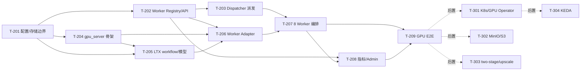

# 工程规划: LTX 2.3 Phase 2 GPU Execution

生成时间: 2026-07-13  
状态: DRAFT  
关联架构: `architecture.md`
关联决策: `arch_decisions.md` D17-D20
上游澄清: `clarifications/architecture/round-7.md`

⚠️ 前置门禁跳过: `review-logs/arch_review.md` 不存在，架构设计未经独立 arch review 文件验证。本规划基于已确认的 Phase 2 架构继续推进。

## 1. 规划概要

### 1.1 目标

在 Phase 1 已完成的非 GPU 控制面上，接入一台 8 卡 GPU 服务器，部署 8 个可配置 GPU Worker，完成真实 LTX 2.3 文生视频/图生视频 E2E。

### 1.2 范围

本阶段包含：

- `gpu_server/` GPU 部署子项目。
- Docker Compose + NVIDIA Container Toolkit 单机 8 Worker 首版部署。
- Worker Registry、register/heartbeat、Admin Worker 状态。
- Dispatcher 派发 queued task 到 idle GPU Worker。
- GPU Worker Adapter 接入 ComfyUI Server API。
- LTX 2.3 distilled single-stage T2V/I2V workflow。
- 本地共享存储或 MinIO，经 `ObjectStorageAdapter` 访问。
- Worker/GPU 指标、DCGM、Phase 2 真实 E2E。

本阶段不包含：

- 多 GPU 服务器集群。
- Kubernetes/k3s + NVIDIA GPU Operator 生产化部署。
- KEDA 自动扩缩容。
- two-stage/upscale profile。
- 用户自由编辑 ComfyUI 节点图。

### 1.3 任务规模

- Phase 2 P0 任务: 9 个
- Phase 2 P1 任务: 0 个
- P2 记录任务: 4 个
- Phase 2 P0 总预估: 15-19 人天
- 单人串行预估: 15-19 工作日
- 2 人并行预估: 9-12 工作日

### 1.4 关键路径

```text
T-201 -> T-202 -> T-203 -> T-204 -> T-205 -> T-206 -> T-207 -> T-208 -> T-209
```

并行机会：

- T-202 与 T-204 可在 T-201 后并行。
- T-205 可与 T-203 并行准备，但真实执行依赖 T-206。
- T-208 可在 T-202/T-204 完成后先接入基础指标，最终验收依赖 T-207。

## 2. 任务概览

| Task ID | 名称 | 优先级 | 关联 Feature | 关联组件 | 依赖 | 预估 | 状态 |
|---|---|---|---|---|---|---|---|
| T-201 | Phase 2 运行配置与共享存储边界 | P0 | F-008, F-010 | ObjectStorageAdapter, Config | - | 1d | TODO |
| T-202 | Worker Registry 数据模型与内部 API | P0 | F-007, F-012 | Worker Registry, Admin | T-201 | 2d | TODO |
| T-203 | GPU Dispatcher 与 ExecutorAdapter 派发改造 | P0 | F-004, F-007, F-009 | Dispatcher, ExecutorAdapter | T-202 | 2d | TODO |
| T-204 | `gpu_server/` 部署子项目骨架 | P0 | F-005, F-007 | GPU Server 子项目 | T-201 | 2d | TODO |
| T-205 | LTX 2.3 distilled single-stage workflow 与模型缓存 | P0 | F-002, F-003, F-005 | Workflow Service, ModelCache | T-201, T-204 | 2d | TODO |
| T-206 | GPU Worker Adapter 接入 ComfyUI API | P0 | F-005, F-008, F-009 | Worker Adapter, ComfyUI | T-202, T-204, T-205 | 2d | TODO |
| T-207 | 单机 8 Worker 编排与健康检查 | P0 | F-005, F-007, F-012 | gpu_server, Worker Registry | T-203, T-206 | 2d | TODO |
| T-208 | Worker/GPU 可观测性与 Admin 展示 | P0 | F-010, F-012 | Metrics, DCGM, Admin | T-202, T-207 | 1.5d | TODO |
| T-209 | Phase 2 真实 GPU E2E 与失败演练 | P0 | F-002, F-003, F-004, F-005, F-007, F-008, F-009, F-010, F-012 | 全链路 | T-207, T-208 | 2.5d | TODO |
| T-301 | Kubernetes/k3s + GPU Operator 多机部署 | P2 | F-007, F-012 | Kubernetes, GPU Operator | Phase 2 完成 | 3d | TODO |
| T-302 | MinIO/S3 生产对象存储切换 | P2 | F-008 | ObjectStorageAdapter | Phase 2 完成 | 1.5d | TODO |
| T-303 | LTX two-stage/upscale profile | P2 | F-002, F-003, F-005 | Workflow Service, Worker Adapter | T-209 | 2d | TODO |
| T-304 | KEDA/队列驱动自动扩缩容 | P2 | F-007, F-012 | KEDA, QueueAdapter | 多机部署完成 | 3d | TODO |

## 3. 任务依赖图



## 4. 任务详情

### T-201: Phase 2 运行配置与共享存储边界

- **优先级**: P0
- **关联 Feature**: F-008, F-010
- **关联组件**: ObjectStorageAdapter, Config
- **目标**: 让 control plane 和 GPU Worker 在单机 Phase 2 下共享输入输出资产，同时保持后续替换 MinIO/S3 的边界。
- **实现方案**:
  - 方案 A: 直接强制 MinIO。优点是接近中期对象存储；缺点是单机首版多一个运行件。
  - 方案 B: 本地共享目录 + `ObjectStorageAdapter` 配置化，MinIO 作为可选后端。推荐，理由: 符合 CLR-ARCH-030，先降低单机 GPU E2E 故障面。
- **验收标准**:
  - [ ] 存在 Phase 2 配置项，可选择 `local_shared` 或 `minio` 存储后端。
  - [ ] `local_shared` 后端输入图和输出视频都经 `ObjectStorageAdapter` 读写，不在业务代码中硬编码本地路径。
  - [ ] Worker 和 control plane 对同一 `storage_uri` 能解析到同一资产。
  - [ ] `storage_uri` 不向外部 API 泄露本地文件系统路径。
  - [ ] 异常路径: 共享目录不可写时，健康检查返回 storage failed，任务不应被标记为 succeeded。
- **依赖**: 无
- **预估**: 1d
- **约束来源**: architecture.md § 3.4, § 3.5, § 8.3, § 8.4; arch_decisions.md D19; CLR-ARCH-030

### T-202: Worker Registry 数据模型与内部 API

- **优先级**: P0
- **关联 Feature**: F-007, F-012
- **关联组件**: Worker Registry, Admin
- **目标**: 让 GPU Worker 能注册、心跳、上报能力和健康状态，并被 Admin/Dispatcher 查询。
- **实现方案**:
  - 方案 A: 只从 Docker/K8s 查询容器状态。缺点是无法表达业务能力、queue_depth、当前 attempt。
  - 方案 B: Worker 主动 register/heartbeat，数据库保存业务健康状态。推荐，理由: 与 architecture.md § 6.3 和 D17 一致。
- **验收标准**:
  - [ ] 数据模型包含 `gpu_nodes` 和 `gpu_workers`，记录 node_name、worker_name、gpu_index、worker_slot、status、capabilities、queue_depth、last_heartbeat_at、metrics_url。
  - [ ] `POST /internal/workers/register` 返回稳定 `worker_id`，同一 worker_name 重复注册不会创建重复可用 worker。
  - [ ] `POST /internal/workers/{worker_id}/heartbeat` 能更新 status、queue_depth、capabilities、当前 attempt。
  - [ ] 超过心跳阈值的 Worker 被标记为 `unhealthy/offline`，Dispatcher 查询不到它。
  - [ ] `/admin/workers` 能返回 8 个 Worker 的 GPU index、状态、心跳延迟、queue_depth、当前任务。
  - [ ] 异常路径: service token 缺失或错误时，内部 Worker API 返回 401/403。
- **依赖**: T-201
- **预估**: 2d
- **约束来源**: architecture.md § 3.2, § 6.2, § 6.3, § 8.2, § 8.4; arch_decisions.md D17; CLR-ARCH-029

### T-203: GPU Dispatcher 与 ExecutorAdapter 派发改造

- **优先级**: P0
- **关联 Feature**: F-004, F-007, F-009
- **关联组件**: Dispatcher, ExecutorAdapter
- **目标**: 把 Phase 1 mock/local 执行替换为可配置 GPU Worker 派发，同时保持外部任务 API 和状态机不变。
- **实现方案**:
  - 方案 A: Task Service 同步 HTTP 调用 Worker 并等待结果。缺点是长任务阻塞控制面。
  - 方案 B: Dispatcher 选择 idle Worker，创建 attempt，调用 Worker Adapter assign endpoint，Worker 异步回传 events。推荐，理由: 符合 architecture.md § 7.1 数据流。
- **验收标准**:
  - [ ] Executor backend 可配置为 `mock-local` 或 `gpu-worker`。
  - [ ] `gpu-worker` 模式下，queued task 被派发到 capabilities 匹配 mode/profile 的 idle Worker。
  - [ ] 派发成功后 task 进入 `running` 或 `dispatching/running`，attempt 记录 worker_id。
  - [ ] 无可用 Worker 时任务保持 queued，且 metrics/Admin 可见 `CAPACITY_UNAVAILABLE` 或 queued reason。
  - [ ] Worker assign 失败时 attempt 标记 failed，retryable 错误重新 queued，非 retryable 进入 failed。
  - [ ] 幂等约束: 同一 task 不会被同时派发给两个 Worker。
- **依赖**: T-202
- **预估**: 2d
- **约束来源**: architecture.md § 3.3, § 6.4, § 7.1, § 7.2, § 8.2; arch_decisions.md D04, D09, D17

### T-204: `gpu_server/` 部署子项目骨架

- **优先级**: P0
- **关联 Feature**: F-005, F-007
- **关联组件**: GPU Server 子项目
- **目标**: 提供 GPU 服务器上的独立部署入口，clone 后进入 `gpu_server/` 即可构建/部署镜像。
- **实现方案**:
  - 方案 A: 只提供散落脚本。缺点是部署入口不清晰，难以交接。
  - 方案 B: 建立 `gpu_server/` 子项目，包含 Dockerfile、compose、配置、scripts、worker_adapter、workflows。推荐，理由: 符合 CLR-ARCH-032。
- **验收标准**:
  - [ ] `gpu_server/README.md` 说明前置条件、配置项、部署命令、健康检查、卸载方式。
  - [ ] `gpu_server/.env.example` 包含 `CONTROL_PLANE_URL`、`WORKER_COUNT`、`GPU_INDICES`、`MODEL_DIR`、`STORAGE_DIR`、`WORKER_TOKEN`。
  - [ ] `gpu_server/Dockerfile` 固定 ComfyUI、ComfyUI-LTXVideo、Python/CUDA 基础依赖版本。
  - [ ] `gpu_server/docker-compose.yml` 支持通过配置启动 1-8 个 Worker。
  - [ ] `scripts/deploy.sh` 和 `scripts/healthcheck.sh` 能在 GPU 服务器上执行。
  - [ ] 异常路径: GPU 不可见时 deploy/healthcheck 失败并给出明确错误。
- **依赖**: T-201
- **预估**: 2d
- **约束来源**: architecture.md § 3.5, § 4.1, § 8.7; arch_decisions.md D18; CLR-ARCH-032

### T-205: LTX 2.3 distilled single-stage workflow 与模型缓存

- **优先级**: P0
- **关联 Feature**: F-002, F-003, F-005
- **关联组件**: Workflow Service, ModelCache
- **目标**: 准备首个真实 LTX 2.3 T2V/I2V workflow 和模型缓存路径，优先支持 distilled single-stage。
- **实现方案**:
  - 方案 A: 直接支持 single-stage、two-stage、upscale。缺点是模型和显存风险过大。
  - 方案 B: 首版只把 `fast` profile 映射到 distilled single-stage；two-stage/upscale 后置。推荐，理由: 符合 D20。
- **验收标准**:
  - [ ] `gpu_server/workflows/` 包含 T2V/I2V 的 LTX 2.3 distilled single-stage Workflow API Format JSON。
  - [ ] `scripts/download_models.sh` 能把模型下载或校验到 `MODEL_DIR`，并输出缺失模型清单。
  - [ ] Workflow Service 中 `fast` profile 可映射到真实 LTX distilled single-stage workflow。
  - [ ] draft/testing/published/rollback 流程对真实 workflow 仍然有效。
  - [ ] 异常路径: 模型文件缺失时 Worker 不注册为 idle，Admin 可见原因。
- **依赖**: T-201, T-204
- **预估**: 2d
- **约束来源**: architecture.md § 2.2, § 3.5, § 7.3, § 8.7; arch_decisions.md D08, D20; CLR-ARCH-031

### T-206: GPU Worker Adapter 接入 ComfyUI API

- **优先级**: P0
- **关联 Feature**: F-005, F-008, F-009
- **关联组件**: Worker Adapter, ComfyUI
- **目标**: Worker Adapter 接收 assigned attempt，调用本机 ComfyUI headless，回传进度、结果和错误分类。
- **实现方案**:
  - 方案 A: 修改 ComfyUI 插件承载业务逻辑。缺点是升级和维护风险高。
  - 方案 B: Worker Adapter 独立进程旁路调用本机 ComfyUI HTTP/WebSocket。推荐，理由: 与 D05 和 architecture.md § 3.3 一致。
- **验收标准**:
  - [ ] `POST /worker/attempts` 接收 attempt_id、task payload、workflow_version_id、input asset URI。
  - [ ] Adapter 能把 prompt、seed、duration、aspect_ratio、image path 注入 Workflow API Format。
  - [ ] Adapter 调用 ComfyUI `/prompt` 后记录 comfy_prompt_id。
  - [ ] Adapter 通过 WebSocket 或 history 轮询回传 progress stage/percent。
  - [ ] 输出视频写入 `ObjectStorageAdapter` 后，回传 succeeded event；Task Service 写入 output asset 和 usage ledger。
  - [ ] ComfyUI prompt 校验失败映射为 `invalid_input` 或 `comfyui_prompt_failed`；Worker crash/transient 映射为 retryable。
- **依赖**: T-202, T-204, T-205
- **预估**: 2d
- **约束来源**: architecture.md § 3.3, § 6.3.1, § 7.1, § 8.2, § 8.6; arch_decisions.md D05, D09, D20

### T-207: 单机 8 Worker 编排与健康检查

- **优先级**: P0
- **关联 Feature**: F-005, F-007, F-012
- **关联组件**: gpu_server, Worker Registry
- **目标**: 在一台 8 卡 GPU 服务器上启动 8 个可配置 Worker，并全部注册为业务可用容量。
- **实现方案**:
  - 方案 A: 一个进程管理 8 张 GPU。缺点是故障隔离差，容量单位不清晰。
  - 方案 B: 8 个 Worker service，每个绑定一个 GPU。推荐，理由: 符合 D06/D17。
- **验收标准**:
  - [ ] 默认 `WORKER_COUNT=8` 时，compose 启动 8 个 Worker，每个 Worker 的 `CUDA_VISIBLE_DEVICES` 唯一。
  - [ ] 8 个 Worker 全部向 control plane 注册，Admin 显示 gpu_index 0-7。
  - [ ] 每个 Worker healthcheck 同时检查 Adapter、ComfyUI、模型路径、存储路径。
  - [ ] 任意 1 个 Worker 停止后，心跳超时内被标记 unhealthy/offline，Dispatcher 不再派发给它。
  - [ ] 恢复 Worker 后可重新注册并变为 idle。
  - [ ] 异常路径: 某张 GPU OOM 时只影响对应 Worker，不影响其他 Worker 派发。
- **依赖**: T-203, T-206
- **预估**: 2d
- **约束来源**: architecture.md § 3.5, § 7.5, § 8.1, § 8.2; arch_decisions.md D06, D17, D18

### T-208: Worker/GPU 可观测性与 Admin 展示

- **优先级**: P0
- **关联 Feature**: F-010, F-012
- **关联组件**: Metrics, DCGM, Admin
- **目标**: 让 Phase 2 上线前能定位哪张 GPU、哪个 Worker、哪个 workflow/profile 导致慢或失败。
- **实现方案**:
  - 方案 A: 只靠日志排查。缺点是无法做容量和失败率分析。
  - 方案 B: Worker `/metrics` + DCGM Exporter + Admin Worker 状态。推荐，理由: CLR-ARCH-026 已确认 Worker 级指标是上线硬要求。
- **验收标准**:
  - [ ] Worker `/metrics` 暴露 worker_status、queue_depth、current_attempt、attempt_runtime_seconds、failure_count、last_heartbeat_age。
  - [ ] GPU 指标至少包含 utilization、memory_used、memory_total、temperature 或能接入 DCGM Exporter。
  - [ ] Control plane metrics 能按 worker_id/profile/error_class 聚合任务成功率、失败原因、平均生成耗时。
  - [ ] Admin `/admin/workers` 展示 8 Worker 状态、GPU index、心跳延迟、当前任务、最近错误。
  - [ ] usage ledger 写入 actual_runtime_seconds，并为 actual_gpu_seconds 留出真实 GPU 计量字段。
  - [ ] 异常路径: Worker 10 分钟无心跳时 Admin 可见 unhealthy/offline。
- **依赖**: T-202, T-207
- **预估**: 1.5d
- **约束来源**: architecture.md § 6.2, § 7.5, § 8.5; arch_decisions.md D10, D13; CLR-ARCH-026

### T-209: Phase 2 真实 GPU E2E 与失败演练

- **优先级**: P0
- **关联 Feature**: F-002, F-003, F-004, F-005, F-007, F-008, F-009, F-010, F-012
- **关联组件**: 全链路
- **目标**: 证明 Phase 2 接入真实 GPU 后，外部 API、任务状态机、资产、workflow、usage 和 Admin 契约保持稳定。
- **实现方案**:
  - 方案 A: 编写 GPU 专用验收脚本绕过外部 API。缺点是不能证明 Phase 1 API 契约仍然成立。
  - 方案 B: 复用 Phase 1 API smoke/e2e，将 Executor backend 替换为 `gpu-worker`。推荐，理由: 符合 architecture.md § 7.1。
- **验收标准**:
  - [ ] 使用同一 `POST /v1/video-generations` API 提交 1 个真实 T2V，最终返回可下载视频。
  - [ ] 使用同一资产上传 API 提交 1 个真实 I2V，最终返回可下载视频。
  - [ ] 并发提交至少 8 个任务时，8 个 Worker 能分别领取任务或按队列顺序稳定派发。
  - [ ] task_id、attempt、workflow_version_id、output asset、usage ledger 在 GPU 路径下无需外部 API 变更。
  - [ ] 停止 1 个 Worker 后，新任务不会派发给该 Worker。
  - [ ] 制造 ComfyUI prompt 失败时，attempt 标记 failed 并写入可诊断 error_class。
  - [ ] 制造模型缺失/GPU 不可见时，Worker 不注册为 idle，Admin 显示原因。
  - [ ] `python3 -m pytest` 的 Phase 1 回归仍然通过。
- **依赖**: T-207, T-208
- **预估**: 2.5d
- **约束来源**: architecture.md § 7.1, § 7.2, § 7.5, § 8.6, § 9; arch_decisions.md D17-D20

## 5. 追溯矩阵

| Feature | 关联任务 | 覆盖状态 |
|---|---|---|
| F-002 文生视频 API | T-205, T-206, T-209 | Phase 2 真实 GPU 完整 |
| F-003 图生视频 API | T-201, T-205, T-206, T-209 | Phase 2 真实 GPU 完整 |
| F-004 异步任务提交/查询/结果 | T-203, T-209 | 外部 API 不变 |
| F-005 ComfyUI headless Worker 执行 | T-204, T-205, T-206, T-207, T-209 | 完整 |
| F-007 GPU Worker 服务发现与单卡执行 | T-202, T-203, T-207, T-209 | 完整 |
| F-008 模型缓存与输入输出对象存储 | T-201, T-205, T-206, T-209 | 完整 |
| F-009 任务重试、attempt、错误分类 | T-203, T-206, T-209 | 完整 |
| F-010 任务计数、GPU 消耗量和额度记录 | T-201, T-208, T-209 | 完整 |
| F-012 Worker 级可观测性 | T-202, T-207, T-208, T-209 | 完整 |

## 6. 风险评估

| 风险 | 影响 | 概率 | 缓解措施 |
|---|---|---|---|
| 8 个 Worker 同时加载 LTX 模型导致磁盘 IO 或显存压力 | Worker 启动慢或 OOM | 中 | `gpu_server/` 支持错峰启动、模型预检、单 Worker healthcheck |
| 本地共享存储在未来多机不可用 | 多机扩展返工 | 中 | 所有资产访问必须经 `ObjectStorageAdapter`，T-302 切换 MinIO/S3 |
| ComfyUI workflow API Format 与 UI workflow 不一致 | prompt 提交失败 | 中 | T-205 固化 API Format JSON，T-206 用真实 `/prompt` 验证 |
| Worker crash 后 attempt 状态不一致 | 任务卡死或重复执行 | 中 | T-203/T-207 要求心跳超时摘除和 retryable attempt 判定 |
| GPU 型号/显存不足稳定运行 LTX 2.3 | E2E 失败或耗时超预期 | 中 | T-205/T-209 首版只验收 distilled single-stage，记录 profile 实测耗时 |
| DCGM/Prometheus 接入耗时 | 观测缺口 | 低 | T-208 先提供 Worker `/metrics`，DCGM 作为 GPU 指标来源接入 |

## 7. Gate 检查

- [x] 每个 Phase 2 P0 Feature 都有对应任务。
- [x] 每个 P0 任务粒度约 1-2 天；T-209 为 E2E 验收任务，允许 2.5 天。
- [x] P0 任务包含异常路径验收。
- [x] 依赖图无循环。
- [x] 验收标准具体到可测试断言。
- [x] 追溯矩阵完整。
- [x] 关键实现路径有 ≥2 方案并已选定。
- [x] 无孤儿任务；P2 后置任务均有明确边界。

结论: PASS_WITH_CONCERN。主要风险是 Phase 2 真实 GPU 规格、模型路径和 LTX 2.3 8 Worker 并发性能需要在 T-205/T-209 中实测。
